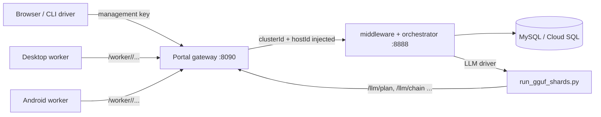

# Ramanujan cluster orchestration and LLM sharding

This is the single reference for how Ramanujan Compute Cluster rooms route
work to devices, how devices talk to the orchestrator, and how the orchestrator
shards a GGUF model across the devices of a room. Model conversion and the
native runtime itself are covered in
[sharded-llm/NATIVE_LLM.md](sharded-llm/NATIVE_LLM.md),
[sharded-llm/GGUF_MODELS.md](sharded-llm/GGUF_MODELS.md) and
[sharded-llm/converter/GGUF.md](sharded-llm/converter/GGUF.md).

## 1. Ownership: who does what

Orchestration lives only in three modules. Nothing else builds orchestrator
routes or decides placement.

| Module | Owns |
| --- | --- |
| `middleware` | Code-run API (`/run`, `/status`), Python translation, DAG creation and tagging of every DAG element with `clusterId`. |
| `orchestrator` | Device registry, task queue and assignment (`/pings/*`, `/task/complete`), native LLM task dispatch (`/llm/step|chain|close`), capacity telemetry (`/pings/capacity`) and **all sharding decisions** (`/llm/plan`, `CapacityDao.VramPlacement`). |
| `ramanujan-device-common` | Everything a device sends: `DeviceProtocol` (the only place device→orchestrator paths and URLs are built), `DeviceOrchestratorClient` (poll, complete, binary upload/stat/fetch), `HeartbeatPinger`, `CheckpointPinger`/`CheckpointPushClient`, `DebugClient`, `DeviceCapacityPinger` + `WorkerCapacity` (capacity telemetry). |

Clients only *use* these pieces:

- `developer-console` (desktop worker `ExecuteInlineWorker`, `WorkerBinaryCache`)
  depends on `ramanujan-device-common`.
- The Android app compiles the same device-common sources (Gradle
  `syncSharedWorker`).
- The Python driver `sharded-llm/run_gguf_shards.py --capacity-aware` only
  describes the model (per-layer byte estimates) and opens the sessions the
  orchestrator returns. It never chooses devices or shard boundaries.
- The portal (`Ramanujan-Compute-Cluster/webapp`) is an authenticating gateway:
  it maps room/device credentials to `clusterId`/device identity and relays to
  middleware/orchestrator. Device onboarding (`/api/devices/join`) is portal
  business, not orchestration.

**Exception: homelab.** `developer-console homelab` is a self-contained local
server for private labs that implements its own small task queue
(`ExecuteInlineHomelabServer`, `AffinityTaskQueue`). See [section 10](#10-homelab-exception).



Middleware and orchestrator run in the same HTTP server (`MainVerticle`); keep
that port private and expose only the portal.

## 2. Rooms, devices and `clusterId`

1. A room owner creates a room: `POST /api/clusters` returns `clusterId`
   (internal UUID), `roomId` (shareable id) and a one-time `joinSecret`
   (stored as a salted scrypt hash).
2. A device joins with `POST /api/devices/join {roomId, joinSecret, name,
   platform}` (`windows|linux|macos|android`). The reply carries a revocable
   `workerUrl` = `<PUBLIC_URL>/worker/<deviceToken>`; only a SHA-256 of the token
   is stored.
3. The worker uses `workerUrl` as its orchestrator base URL. The gateway accepts
   only these worker routes: `/pings/open`, `/pings/heartbeat`,
   `/pings/capacity`, `/task/complete`, `/binary/fetch`, `/binary/stat`,
   `/orchestrator/uploadBinary`. For each request it strips caller-supplied
   `clusterId`/`hostId`/`uuid` and injects the device's real `clusterId` and
   device id (`hostId`, and `uuid` on `/pings/*` and `/binary/*`).
4. Room owners reach the LLM API through
   `/api/clusters/<roomId>/homelab/<route>` with routes `/llm/chain`,
   `/llm/step`, `/llm/close`, `/llm/capacity`, `/llm/plan`, `/llm/plan/release`.
   The gateway injects the room's `clusterId` and checks that every weight file
   lies inside `MODEL_ROOT` or the owner's own models.
5. Code jobs (`POST /api/clusters/<roomId>/jobs`) call middleware `/run` with
   the room's `clusterId`.

A `clusterId` is a routing tag, not a credential. The services trust the
forwarded identity, so only the gateway may be reachable from outside.

### Routing rule

- Work tagged with `clusterId` runs only on devices registered with that same
  `clusterId`.
- Untagged work (no `clusterId`, legacy behavior) can run on any device.

Middleware tags the workflow record and every DAG element
(`RunService`), stores the tag in `BasicDagElement` storage and SQL DAG
metadata, and passes it on every orchestration submission and retry.
Checkpoint resume and stale-device retries reload the stored tag rather than
creating untagged placeholders.

The orchestrator keeps available devices in memory (`HostDaoStackImpl`) with
their cluster and last-seen time; a device is dropped after
`HOST_STALE_MILLIS` = 60 s without an open ping. Selection skips a device when:

- the task is tagged and the device's cluster differs;
- the task is pinned to a host (`nativePreferredHost`, from a capacity plan or
  session ownership) and this is another host;
- capacity-aware mode is on and the device is reserved by an ACTIVE capacity
  plan (unpinned work cannot steal a reserved device).

SQL host mappings store the *assigned device's* cluster, so an untagged task
given to a clustered device is still isolated from other identities.
`/task/complete` requires the exact assigned host and cluster; anything else is
HTTP 403. Status lookups (`/status`, `/statusorch`) of tagged work require the
same `clusterId`.

### SQL schema

Apply once to an existing database, before deploying new services (fresh
databases created from the updated schema already contain these):

| Migration | Adds |
| --- | --- |
| `db-layer/src/main/resources/migrations/20261002_cluster_routing.sql` | Nullable, case-sensitive (`utf8mb4_bin`) `clusterId` on `asyncTaskMiddleware`, `asyncTaskOrchestrator`, `dagElementMetadata`, `availableHost`, `hostMapping`. Existing rows stay untagged. |
| `20261002_native_inference.sql` | Native LLM task columns on `asyncTaskOrchestrator` (`llm`, `nativeResult`, `nativeState`, `nativeDeadline`, `nativeFiles`, `nativeBindings`, `binaryArrayFiles`), `hostMapping.assignedNonce`, and tables `nativeAffinityOwner` (session → owning host/cluster/state), `nativePositionClaim` (no replay of a stateful position), `nativeTaskDelivery`. |
| `20261002_capacity_admission.sql` | `workerCapacity` (latest snapshot per host), `llmCapacityPlan` (plans), `capacityClusterLock` (per-room lock row). |

The portal's own tables come from `Ramanujan-Compute-Cluster/webapp/schema.sql`
(`npm run migrate`).

## 3. Device protocol (`ramanujan-device-common`)

All paths are constants in `DeviceProtocol`; URL builders trim trailing slashes
and URL-encode identities.

| Constant | Route | Purpose |
| --- | --- | --- |
| `OPEN_PATH` | `POST /pings/open?uuid=<device>[&affinityLimit=N]` | Long-poll for a task (client read timeout 120 s). Empty body = no task. |
| `HEARTBEAT_PATH` | `POST /pings/heartbeat?uuid=<device>&asyncId=<task>` | Liveness while running a task. |
| `CAPACITY_PATH` | `POST /pings/capacity` | Capacity telemetry (below). |
| `CHECKPOINT_PATH` | `POST /pings/checkpoint?asyncId=<task>` | Checkpoint push. |
| `TASK_COMPLETE_PATH` | `POST /task/complete` | `{uuid: task, hostId, clusterId?, data?, error?}`. |
| `UPLOAD_BINARY_PATH` | `POST /orchestrator/uploadBinary?uuid=<task>&arrayId=<id>` | Octet-stream result arrays. |
| `BINARY_STAT_PATH` | `GET /binary/stat?path=<server path>` | `{status, size, mtime}` before a download. |
| `BINARY_FETCH_PATH` | `GET /binary/fetch?path=<server path>` | Weight/input download (verified against `Content-Length`, `X-Ramanujan-Mtime`). |
| `DEBUG_VALUES_PATH` | `POST /debugValues?asyncId=<task>` | Debugger values. |

`DeviceOrchestratorClient` wraps poll/complete/upload/stat/fetch and tracks open
connections so `close()` aborts them on shutdown.

### Capacity pings

`DeviceCapacityPinger` runs on its own daemon thread (`device-capacity-ping`):
one immediate send, then about every 10 s, with 3 s connect/read timeouts.
Failures never stop task execution. Before its first sample it performs one
native preflight (load `ramanujan_llm`, select the OpenCL device, build kernels;
no sessions or weights). A failed preflight reports `nativeReady=false`, which
makes the device ineligible for LLM placement.

`WorkerCapacity` builds schema version 1:

| Field | Meaning |
| --- | --- |
| `schemaVersion`, `hostId`, `bootId`, `sequence` | Identity; `bootId` changes on every worker start, `sequence` increases per sample. The server rejects out-of-order samples and samples from retired boots. |
| `ramTotalBytes`, `ramAvailableBytes`, `ramAllocatedBytes` | Physical RAM (Java 8 OS MXBean on desktop, `ActivityManager` on Android; never JVM heap). Unknown = `null`. |
| `gpuTotalBytes`, `gpuAvailableBytes`, `gpuAllocatedBytes`, `gpuResidentBytes`, `gpuMaxAllocationBytes` | Selected OpenCL device. `gpuAllocatedBytes` counts this runtime's live buffers (resident + streamed weights, state, scratch). OpenCL has no portable free-memory query, so `gpuAvailableBytes` is usually `null`. |
| `gpuDeviceName`, `gpuDeviceVendor`, `gpuDriverVersion`, `gpuRuntime`, `gpuRuntimeVersion` | Informational. |
| `unifiedMemory` | GPU shares host RAM (Apple silicon, integrated GPUs). |
| `diskAvailableBytes`, `cacheBytes` | Cache filesystem. |
| `activeSessions`, `sessionLimit`, `capacitySessionLimit`, `affinityLimit`, `activePlans` | Session accounting. |
| `acceptingNewWork`, `nativeReady`, `supportsStreaming`, `supportsRuntime`, `llmRuntimeAvailable` | Readiness. |
| `cachedFiles` | Up to 4096 `{path, bytes, mtime}` of immutable cached weight files (server paths; no token URLs). |
| `cachedShards` | `[{model, embed, head, layers: [[start, end), ...], bytes}]` from the worker's `shards.json` (section 6). |

There are no client timestamps; the server stamps `receivedAt`.

### Worker sessions

`--llm-sessions N` (default 8) caps pinned native sessions, including ones being
opened. A full worker rejects new sessions before downloading; it never evicts
another session's KV/recurrent state. Sessions end only on explicit
`/llm/close` or worker shutdown. `--capacity-session-limit N` (opt-in, 1..1024)
raises the ceiling for tasks that carry a `planId` only. Downloads keep a
`--disk-reserve-bytes` reserve (default 64 MiB) and preflight the sum of all
uncached files in a graph before fetching any.

## 4. Memory budgets

`CapacityDao` turns the latest snapshot into budgets. Constants:

| Constant | Value |
| --- | --- |
| `FRESH_MILLIS` | 45 s: older snapshots are ignored for new plans |
| `HEADROOM` | 256 MiB |
| `GPU_RESERVE` | 1 GiB |

A device is **eligible** when its snapshot is fresh, `acceptingNewWork` is true,
`nativeReady` is not false, and RAM total/available, GPU total and disk are
known.

```
gpuBudget      = min(gpuTotal - max(1 GiB, 10% of gpuTotal),
                     gpuAvailable + gpuAllocated   // only if gpuAvailable is reported
                 ) - 256 MiB
ramBudget      = min(75% of ramTotal,
                     ramAvailable + ramAllocated (+ gpuAllocated if unified)) - 256 MiB
residentBudget = unified ? min(gpuBudget, ramBudget) : gpuBudget
```

What a set of sessions needs on one device (`required`):

```
state     = Σ stateBytes                       (KV cache / DeltaNet state)
weights   = Σ weightBytes of resident sessions
workspace = Σ (scratchBytes + streamWorkingBytes of streamed sessions)
device    = state + weights + workspace
hostRam   = unified ? device : state + workspace
```

A placement **fits** (`fits`) when, counting every ACTIVE plan already on the
host:

- the session count is within `capacitySessionLimit`/`sessionLimit` (and
  `affinityLimit`), and the host has no unknown legacy sessions;
- the largest single allocation ≤ `gpuMaxAllocationBytes`;
- `device ≤ gpuBudget` and `hostRam ≤ ramBudget`;
- uncached files + 256 MiB ≤ `diskAvailableBytes` (a file is cached only if
  path, size **and** mtime match `cachedFiles`).

### Where the per-piece numbers come from

`sharded-llm/converter/ramanujan_shards/llm_capacity.py` derives each piece's
budget from its graph and the real manifest descriptors (no model-name
guessing):

- `weightBytes`/`files`: sums of referenced tensor files (validated against
  sizes and quantized shapes), each with its `mtime` in ms.
- `streamWorkingBytes` = `streamItemBytes` + `streamSharedBytes`: one consumed
  item plus `stream_depth` prefetched items (largest layer/head) and 32 MiB
  staging per loader thread; embeddings need one quantized row.
- `stateBytes`: FP32 K/V at `max_context` (plus DeltaNet state for qwen35),
  doubled for host/device copies.
- `scratchBytes` (with the shareable part in `sharedScratchBytes`): FFN,
  attention, full-context scores, RoPE, logits, transport and upload buffers,
  plus an 8 MiB margin per session.
- `maxAllocationBytes`: largest single native buffer.

Supported shapes: `llama`, `qwen2`, `qwen3`, `phi3`, `gemma`, `qwen35`. Unknown
architectures or quantizations fail before admission; they still run on the
non-capacity-aware path.

## 5. Sharding algorithm (`CapacityDao.VramPlacement`)

The driver splits the model into ordered whole **pieces**: embedding, each
transformer layer, output head. It sends every piece with its estimate to
`POST /llm/plan {"placement": "vram", "weights": "auto"|"resident", stages:
[...]}`. Inside one per-room lock the orchestrator:

1. **Collects eligible devices** of the room and orders them by *free* resident
   budget (`residentBudget` minus what ACTIVE plans already hold on the
   device), largest first; ties by host id.
2. **Greedy big-to-small walk.** Starting at piece 0, each device in order takes
   the *longest* run of consecutive pieces that still fits fully resident
   (binary search with `fits`). The cursor moves to the end of that run and the
   next device continues. The biggest device therefore gets the biggest shard,
   and a model that fits one device is never split.
3. **Merging** (`group`). Each resident run becomes **one session**: weights and state
   add up, the non-shared scratch adds up, while shared scratch, the stream
   item and stream-shared buffers count once (the embedding row buffer is kept
   separately). The merged graph is built server-side from the piece graphs.
4. **Streaming fallback (`weights=auto`).** If resident memory cannot hold the
   whole model, the walk is repeated with each device in turn acting as the
   last, *streaming* device. That device lays out
   `[resident layers][streamed layers][resident head]` (the head stays resident
   on ties, since streaming it widens every prefetch window) and streams the
   rest from its disk cache each token. Streaming fits as long as state +
   workspace + one stream window fit, so a model can exceed the room's combined
   memory.
5. **Cached-shard candidates** (section 6) are added.
6. **Scoring.** Every complete candidate is scored by
   `(bytes streamed per token, bytes that must be newly downloaded)`; the
   smallest wins. Streaming costs disk I/O on every token, a download is paid
   once. The search stops early once a candidate streams nothing.

Every device ends up with one contiguous range `[start, end)` of pieces: one
session per resident device, and up to three sessions (resident, streamed,
resident head) on the single streaming device. There is no tensor
parallelism: inference flows
device → device in order, with hidden states passed between ranges.

The reply lists, for each range: `affinity`, `session`, `hostId`, `weights`
(`resident`/`stream`), `pieces`, merged `graph`, `weightBytes`, `deviceBytes`,
`gpuBudgetBytes`, `ramBudgetBytes`, `gpuTotalBytes`, `unifiedMemory` and
`downloadBytes` (0 = fully cached). The driver recomputes each merged graph
locally and refuses to run if it differs.

### Worked example: 20 GB model on 16 GB + 8 GB GPUs

Discrete GPUs, nothing else running, budgets before state/scratch:

| Device | VRAM | `gpuBudget` |
| --- | --- | --- |
| A | 16 GiB | 16 − max(1, 1.6) − 0.25 = **14.15 GiB** |
| B | 8 GiB | 8 − max(1, 0.8) − 0.25 = **6.75 GiB** |

A is visited first and takes embedding + layers up to the point where weights +
KV + scratch reach 14.15 GiB (about 13.5 GiB of weights for a typical
context). B continues from that layer and takes the remaining ~6.5 GiB
including the head. Result: two resident ranges, A ≈ 13.5 GB and B ≈ 6.5 GB,
nothing streamed. If B had only 4 GiB, the remainder would not fit resident;
the `auto` candidates then make one device stream the leftover middle layers,
and the candidate streaming the fewest bytes wins.

A 0.5 GB model with the same two devices stays entirely on A (verified below).

### Legacy `search` placement

Without `"placement": "vram"` (the driver uses this only for `--check-layers`
diagnostics, which keep one session per piece), `allocate` assigns the
requested stages in order to devices with backtracking: first all-resident,
then all-stream if `weights` allows. It is still decided by the orchestrator.

## 6. Reusing cached shards after a restart

Each worker keeps `shards.json` in its cache directory (`WorkerShardManifest`).
Per model (key = SHA-256 of the graph's key-sorted `hyper` JSON) it records the
embedding/head flags, layer indices and the weight files behind them. It is
written atomically, survives restarts, is scoped to the worker's gateway, and
holds up to 16 models. A unit is reported in `cachedShards` only while all its
files are still in the cache.

When a device rejoins:

1. **Anchors** (`anchors()`): for every device reporting this model (largest
   first), the orchestrator finds the longest run of consecutive pieces that
   lie in the reported shard *and* whose files still match `cachedFiles`
   (size + mtime). It trims the run to what fits resident now. Pieces already
   claimed by a larger device are skipped.
2. **Anchored walk** (`anchoredWalk()`): anchored devices keep their offsets.
   The gaps before, between and after anchors are filled big to small by the
   other devices. An anchored device may extend its range earlier if a gap
   cannot be filled, and later up to the next anchor. Optionally one device
   streams what is left at the end.
3. The anchored candidates compete with the plain big-to-small candidates
   using the same score, so cache reuse wins whenever it streams no more bytes,
   and among equals the plan downloading less wins.

Example: device 1 has cached the first 8 GB (embedding + layers 0–15) of a
16 GB model and restarts. Its pings report `cachedShards: [{layers: [[0,16)],
embed: true, ...}]`. The plan keeps device 1 on pieces `[0, 17)` with
`downloadBytes: 0`, and the next device starts at layer 16 for the remaining
8 GB. Only those 8 GB are downloaded.

## 7. Plan lifecycle

```
POST /llm/plan            {stages, weights, placement:"vram", dryRun?}
   ├─ dryRun → {dryRun:true, stages:[...]}      nothing reserved/opened/downloaded
   └─ → {planId, stages:[...]}                  plan ACTIVE, devices reserved
POST /llm/chain | /llm/step {..., planId}       first step carries the pinned graph
POST /llm/close            {..., planId}        once per planned session
POST /llm/plan/release     {planId}             only after every close succeeded
```

- `pin()` validates every planned task: the plan is ACTIVE, the binding belongs
  to it and is not closed, a chain never crosses devices, the host's `bootId`
  is unchanged (a restarted worker requires a new inference), the graph equals
  the pinned graph and the files are a subset of the planned files. The task is
  then pinned to the planned host.
- On task completion, `NativeLlmService.complete()` first records the session
  state (`nativeAffinityOwner` CLOSED/FAILED, plan stage `opened`/`closed`) and
  **then** publishes the result. The driver releases the plan immediately after
  the last close result, so the stage must already be marked closed by then.
- `release()` refuses (HTTP 409 "Close every planned session…") while any stage
  is not closed. A failed or timed-out close therefore keeps the capacity
  reserved; no timer silently frees memory that native code may still use.
- Plans are stored per room in `llmCapacityPlan`; released plans are pruned.
  `CapacityStore.atomic` serializes all capacity updates of one room across
  orchestrator processes with `SELECT ... FOR UPDATE` on `capacityClusterLock`.
- A placement is computed per run, so it follows devices joining, leaving or
  filling up. A running session is never migrated.

`GET /llm/capacity` lists the room's snapshots with `fresh`, `eligible`,
`gpuBudgetBytes`, `ramBudgetBytes`, `gpuCommittedBytes` and `ramCommittedBytes`.

## 8. Running it

Enable capacity-aware placement after applying the migrations:

```sh
export RAMANUJAN_CAPACITY_AWARE=1      # on middleware/orchestrator and portal
```

Without it, LLM sessions use first-request affinity assignment (the original
behavior).

Direct CLI inference through a room (management key in `RAMANUJAN_PORTAL_TOKEN`,
sent only as an HTTP header):

```sh
python3 sharded-llm/run_gguf_shards.py --runtime native \
  --homelab https://PORTAL/api/clusters/ROOM_ID/homelab \
  --package MODEL/shards --metadata MODEL/ir-plan/gguf-metadata.json \
  --capacity-aware --weights auto --max-context 1024 \
  --prompt "..." --max-new-tokens 32
```

- `--capacity-dry-run` prints the `capacity-placement` event (per device:
  layers, shard bytes, device bytes, budget, download bytes) and exits before
  reserving, opening or downloading anything.
- `--capacity-aware` requires `--runtime native` and `--homelab`; it rejects
  `--resident-weights` and `--weights stream` (the orchestrator decides when to
  stream).
- `--check-layers N` keeps every piece as its own session for diagnostics.

Worker:

```sh
RAMANUJAN_WORKER_URL=<workerUrl from join> RAMANUJAN_WS=<dir with native libs> \
  java -jar developer-console-1.0-SNAPSHOT-fat.jar worker 1 \
  --cache ~/.ramanujan/worker-cache --llm-sessions 8
```

`RAMANUJAN_WS` must contain `libramanujan_llm` (and `libnative` for DAG work);
otherwise the worker joins but reports `nativeReady=false` and receives no LLM
shards.

## 9. Validation

Unit tests:

```sh
mvn -f ramanujan-device-common/pom.xml clean install          # DeviceProtocolTest, DeviceCapacityPingerTest
mvn -f orchestrator/pom.xml clean install                     # CapacityDaoTest, NativeLlmRoutingTest, ClusterRoutingTest, CentralNativeHttpTest
mvn -f developer-console/pom.xml -Djava.io.tmpdir=$PWD/developer-console/target/test-work test
python3 -m unittest discover -s sharded-llm/tests              # incl. test_capacity_planning
(cd sharded-llm/converter && python3 -m unittest discover -s tests)
(cd Ramanujan-Compute-Cluster/webapp && npm test)
```

Opt-in GPU preflight smoke test:

```sh
RAMANUJAN_WS=/abs/native/build mvn -f developer-console/pom.xml \
  -Dtest=WorkerCapacityNativeProbeTest -Dramanujan.test.nativeProbe=true test
```

Measured end-to-end (Qwen2.5-0.5B-Instruct Q8, 485 MB of shards, prompt "List
the first ten prime numbers", 32 tokens, all output `2, 3, 5, 7, 11, 13, 17, 19,
23, ...`, every plan RELEASED afterwards):

| Devices in room | Placement chosen by orchestrator | Decode tok/s |
| --- | --- | --- |
| Linux VM, Tesla T4 | T4: embed + layers 0–23 + head, resident (13.8 GB budget) | 2.71 |
| Linux T4 + Mac M3 8 GB (both `nativeReady`) | Same: whole model on T4, Mac idle (fits one device, so no split) | 2.21 |
| Windows Server VM, Tesla T4 | Windows T4: whole model, resident (14.2 GB budget) | 2.19 |

At this size every token makes a gateway→orchestrator→worker round trip, so
tok/s is dominated by per-token orchestration latency, not GPU time.

## 10. Homelab exception

`java -jar developer-console-1.0-SNAPSHOT-fat.jar homelab 8888` is a trusted,
single-process server for private labs. It is not an authentication boundary:
bind it to loopback (`RAMANUJAN_HOMELAB_BIND_ADDRESS=127.0.0.1`) or a private,
firewalled interface behind a gateway.

It honors the same routing rule. Optional `clusterId` on `POST
/orchestrator/run`, `/llm/step|chain|close`, `GET /pings/open`,
`/binary/fetch|stat`, `/orchestrator/uploadBinary`, `/task/complete` and
`/orchestrator/dump` tags work. Tagged tasks go only to workers polling with
the same cluster; untagged tasks go to anyone. Completion requires the assigned
worker's `hostId` and cluster (otherwise 403). Affinity ownership, chain
grouping, native session names and fetch allowlists are namespaced by cluster.
Inline CSV `fileName`s are logical labels (`[A-Za-z_][A-Za-z0-9_]*(\.csv)?`),
never server paths. Homelab does not implement capacity plans; `/llm/plan` is
orchestrator-only.
