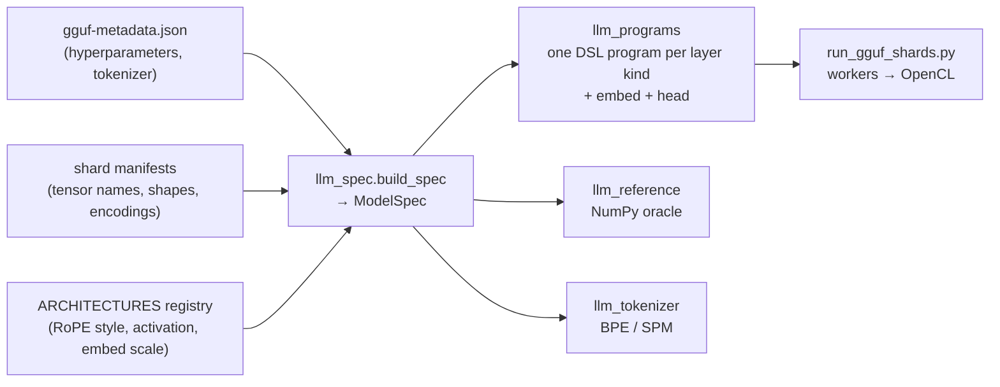

# Running any GGUF LLM on Ramanujan

`run_gguf_shards.py` runs a sharded GGUF model on Ramanujan workers. Each layer
executes as generated Ramanujan DSL compiled to OpenCL, and nothing in the
pipeline is specific to one model. The layer structure is read from the GGUF
tensor names and shapes. Hyperparameters come from the GGUF metadata. A small
registry supplies only the facts GGUF does not store.

`--runtime native` runs the same packages on `libramanujan_llm`, a dedicated
OpenCL LLM runtime. On small models it is 56–75x faster; see
[NATIVE_LLM.md](NATIVE_LLM.md), which also compares its speed with llama.cpp.

### Validated models (native runtime)

Measured on an 8 GB Apple M3 (4 shards, greedy decoding, no chat template):

- **`--check-layers`:** native OpenCL against the NumPy reference, every layer,
  as the max relative error.
- **llama.cpp agreement:** `compare_llama_cpp.py --gpu-layers -1` (llama.cpp on
  Metal) over a 39–49 token prompt. It reports the positions where the top
  token matches, then the median and minimum logit correlation.

| Model | Arch | `--check-layers` | llama.cpp agreement | "What is 17 * 23?" |
|---|---|---|---|---|
| TinyLlama 1.1B Chat Q4_K_M | `llama` | 1.1e-5 (22 layers) | 49/49, 1.0000 / 0.9987 | end-of-text immediately |
| Qwen2.5 0.5B Instruct Q4_K_M | `qwen2` | 5.8e-6 (24) | 39/40, 1.0000 / 0.9998 | works through 17 × 20 = 340, no product within 110 tokens |
| Qwen3 0.6B Q4_K_M | `qwen3` | 1.3e-5 (28) | 40/40, 1.0000 / 1.0000 | " Let's see... Hmm, I need to calculate 17 multiplied by 23." (32 tokens, no product) |
| Llama 3.2 1B Instruct Q4_K_M | `llama` | 2.0e-6 (16) | 41/41, 1.0000 / 0.9999 | " 17 * 23 = 391\nAnswer: 391" |
| Gemma 1.1 2B it Q4_K_M | `gemma` | 1.0e-6 (18) | 39/39, 0.9999 / 0.9999 | "\n\nAnswer: 391\n\nExplanation:\n\n17 * 23 = 391" |
| Phi-3 mini 4k Instruct Q4 | `phi3` | 5.8e-6 (32) | 49/49, 1.0000 / 0.9999 | `<\|end\|>` immediately (llama.cpp too: it needs the chat template) |
| ERNIE 4.5 0.3B PT Q4_K_M | `ernie4_5` (**unregistered**) | 2.2e-6 (18) | 42/44, 0.9999 / 0.9995 | "\n\nA. 340\nB. 34\nC. 3400\nD. 34000" (wrong; 0.3B base model) |
| InternLM2.5 1.8B Chat Q4_K_M | `internlm2` (**unregistered**) | 1.7e-6 (24) | 43/43, 0.9999 / 0.9997 | "To find the product of 17 and 23, … 1. Multiply the units digit: 7 * 3" (32 tokens) |
| Qwen3.8 27B Q4_1 | `qwen35` | 3.1e-7 (first 4 layers) | see [QWEN35_GGUF.md](QWEN35_GGUF.md) | "\n\nTo solve 17" |

On every model, `--reference-token` picks the same token as the NumPy
reference. Asked "The capital of France is", every model answers " Paris"
except ERNIE, which writes "...\n\nA. FRANCE". Over 10 tokens of that prompt,
llama.cpp produces the same tokens for every model: on Metal for the small
models, and on CPU for the 27B (see
[NATIVE_LLM.md](NATIVE_LLM.md#speed-against-llamacpp)). Phi-3's math answer
was also checked and matches.

### Validated models (DSL runtime)

The default DSL runtime was validated on these three models:

| Model | Arch | Quants in file | `--check-layers` (all layers, OpenCL vs NumPy) | Output ("The capital of France is") | Decode |
|---|---|---|---|---|---|
| TinyLlama 1.1B Chat Q4_K_M | `llama` | Q4_K, Q6_K, F32 | 5.8e-5 max rel. error, 22 layers | " Paris.\n\n2. B.C." (= llama.cpp) | ~0.7 s/token |
| Qwen2.5 0.5B Instruct Q4_K_M | `qwen2` | Q5_0, Q8_0, Q4_K, Q6_K, F32 | 2.3e-5, 24 layers | " Paris. It is the largest city in Europe and" | ~0.65 s/token |
| Qwen3.8 27B Q4_1 | `qwen35` | Q4_1, Q5_K, Q6_K, F32 | 1.2e-6, first 4 layers (2.0e-5 over all 64, see [QWEN35_GGUF.md](QWEN35_GGUF.md)) | " Paris.\nThe capital of Germany is" | ~7.6–9 s/token |

On every run, `--reference-token` picks the same token as the NumPy reference,
with a max logit error of 3e-5 to 8e-5.

### Checking against llama.cpp

`compare_llama_cpp.py` checks the NumPy reference itself against llama.cpp.
It reports whether the tokenization matches, per-position argmax and logit
correlation, and optionally llama.cpp's greedy continuation. For the
tokenization check, llama.cpp applies its own BOS rule. That check caught a
bug: Llama 3.x GGUFs have no `add_bos_token` key, and our tokenizer dropped
their BOS, while llama.cpp adds it for `llama-bpe`/`llama3` pre-tokenizers.
The tokenizer now follows llama.cpp's defaults.

Pass `--gpu-layers -1` to compare against llama.cpp on Metal (or CUDA). The
CPU backend rounds activations to 8 bits inside its matmuls, while Ramanujan
and the NumPy reference keep them in float32. The CPU backend is therefore the
noisy side, as the Phi-3 BOS position shows:

| Phi-3, position 0 | Correlation | Top token |
|---|---|---|
| NumPy reference vs llama.cpp Metal | 1.0000 | same |
| llama.cpp CPU vs llama.cpp Metal | 0.8067 | different |

Over the 10 prompt and generated positions, our top token matches llama.cpp
Metal at 10/10 and llama.cpp CPU at 7/10. Against the CPU backend, the correct
models above show median correlation 0.997–0.9996 and 84–98% top-token
matches. Their greedy output can also diverge at near-ties: for example
Qwen2.5/France at the 9th token, " Europe" vs " the" with a 0.19 logit gap.

## How it works



1. **Spec** (`llm_spec.py`). Each `blk.N.*` tensor set is classified as
   `attention` or `gated_deltanet` from its tensor suffixes. The optional
   pieces become flags, detected from which tensors exist and their shapes:
   - Q/K/V biases, per-head Q/K norms
   - output gate packed into `attn_q` (rows = 2·heads·head_dim)
   - fused `attn_qkv` and fused `ffn_up` (gate‖up)
   - post-attention and post-FFN norms
   - per-dimension `rope_freqs`
   - tied embeddings (no `output.weight`)

   Layers that share a mixer, the same flags and the same per-tensor encodings
   form one *kind*. Q4_K_M files mix quants across layers, so TinyLlama and
   Qwen2.5 each have two attention kinds, and Qwen3.8-27B has one DeltaNet kind
   and one attention kind.
2. **Programs** (`llm_programs.py`). One layer program per kind, plus the
   embedding-row decode and the head (final RMSNorm → output matvec → argmax).
   Matvec kernels decode GGUF blocks in-kernel with one intrinsic per quant.
   Array names equal the GGUF role (`attn_q`, `ffn_down`, `attn_q_bias`, …).
3. **Runner** (`run_gguf_shards.py`). Binds each layer's tensors by role,
   allocates its state (KV cache, or DeltaNet recurrent and conv state), and
   moves the hidden state from shard to shard. It supports the local JVM
   workers, `--homelab`, page-cache prefetch, `--check-layers` and
   `--reference-token`, as described in [QWEN35_GGUF.md](QWEN35_GGUF.md).
   `run_qwen35_shards.py` is kept as an alias.

### Architecture semantics registry

GGUF does not record three model-specific facts. The runner takes them from
`llm_spec.ARCHITECTURES`:

| Architecture (`general.architecture`) | RoPE | FFN activation | Embedding scale |
|---|---|---|---|
| `llama` (also Mistral 7B, SmolLM, TinyLlama GGUFs), and any unregistered arch | norm (adjacent pairs) | SiLU | 1 |
| `qwen2`, `qwen3`, `qwen35`, `phi3` | NeoX (halves) | SiLU | 1 |
| `gemma` | NeoX | GELU (tanh) | √dim |

For an architecture outside the registry, the runner assumes llama semantics,
prints that assumption in its `model` event, and accepts overrides:
`--rope-style {norm,neox} --activation {silu,gelu} --embed-scale {none,sqrt_dim}`.

### Unregistered architectures

An unregistered llama-style GGUF has one of three outcomes:

1. **Runs correctly.** ERNIE 4.5 (`ernie4_5`) and InternLM2.5 (`internlm2`)
   ran with no flags. Both use llama semantics in llama.cpp
   (`LLAMA_ROPE_TYPE_NORM`, RMSNorm, SiLU, no embedding scale).
2. **Is rejected with an error** naming one of:
   - an unknown tensor
   - an unsupported feature (see below)
   - an unknown `tokenizer.ggml.pre`
   - an `<arch>.*` metadata key the translator does not read

   An unread key can change the math without the runtime noticing (e.g.
   `attention.clamp_kqv`), so `build_spec` rejects every key outside
   `llm_spec.KNOWN_METADATA`. It also rejects `attention.causal = false`.

   If llama.cpp's graph for that architecture (`src/models/<arch>.cpp`) shows
   a key does not affect the output, pass `--accept-metadata KEY` (repeatable)
   to `run_gguf_shards.py` and `compare_llama_cpp.py`.
3. **Runs but is silently wrong**, when GGUF's missing facts (RoPE style,
   activation, embedding scale) differ from llama's.

   `--check-layers` cannot catch this, because the NumPy reference makes the
   same assumption. Use `compare_llama_cpp.py --gpu-layers -1` on a prompt of
   ~40+ tokens. Position 0 alone proves nothing, because RoPE does not rotate
   it.

A wrong RoPE guess is easy to see:

| Model (llama.cpp Metal, ~44-token prompt) | Default (norm RoPE) | Wrong: `--rope-style neox` |
|---|---|---|
| ERNIE 4.5 0.3B | 42/44, median 0.9999, min 0.9995 | 24/44, median 0.9284, min 0.5969 |
| InternLM2.5 1.8B | 43/43, median 0.9999, min 0.9997 | 22/43, median 0.8543, min 0.4214 |

Validating a new model:

```sh
python3 run_gguf_shards.py --runtime native ... --check-layers N        # kernels vs NumPy, every layer
python3 compare_llama_cpp.py --gguf $M.gguf ... --gpu-layers -1 --prompt "<40+ tokens>" --greedy-tokens 16
```

If correlation is not ≥ 0.999 on Metal, try the overrides before trusting
the output.

### Supported pieces

| | Supported |
|---|---|
| Quant types (in-kernel decode) | F32, F16, Q4_0, Q4_1, Q5_0, Q5_1, Q8_0, Q4_K, Q5_K, Q6_K |
| Tokenizers | `tokenizer.ggml.model` = `gpt2` (byte-level BPE; pre-tokenizers default, gpt-2, llama3/llama-bpe, smollm, qwen2, qwen35) or `llama` (SentencePiece with byte fallback). BOS follows `add_bos_token`, else llama.cpp's default for the vocabulary |
| RoPE scaling | none, linear |
| Attention | GQA/MQA, causal, optional output gate |

These are rejected with an error naming the feature:

- mixture of experts (`ffn_gate_inp`)
- LayerNorm
- Mamba, MLA, RWKV
- logit soft-capping, and scalar multipliers (`embedding_scale`,
  `residual_scale`, `logit_scale`, e.g. Granite)
- YaRN/LongRoPE scaling
- sliding windows shorter than the context
- per-layer hyperparameter arrays
- any unrecognized layer tensor

The dequantizers in `llm_reference.py` match the llama.cpp `gguf` package
bit for bit on every supported type.

## Commands

From `ramanujan/sharded-llm` (build steps and flags are in
[QWEN35_GGUF.md](QWEN35_GGUF.md#commands)):

```sh
M=~/Desktop/ramanujan_oss/gguf-models/tinyllama-1.1b-chat-v1.0.Q4_K_M
# Shard and plan (from converter/)
(cd converter && PYTHONPATH=. python3 -m ramanujan_shards.emit_gguf --gguf $M.gguf --output-dir $M-shards --shards 4 \
  && PYTHONPATH=. python3 -m ramanujan_shards.gguf_ir_plan --package $M-shards --gguf $M.gguf --output-dir $M-ir-plan)
# Generate
python3 run_gguf_shards.py --package $M-shards --metadata $M-ir-plan/gguf-metadata.json \
  --prompt "The capital of France is" --max-new-tokens 10 --work-dir /tmp/gguf-run
# OpenCL vs NumPy, every layer; then NumPy vs llama.cpp (pip install llama-cpp-python gguf)
python3 run_gguf_shards.py ... --check-layers 22 --work-dir /tmp/gguf-check
python3 compare_llama_cpp.py --gguf $M.gguf --package $M-shards --metadata $M-ir-plan/gguf-metadata.json --gpu-layers -1 --greedy-tokens 10
# Native runtime (no --work-dir; see NATIVE_LLM.md)
python3 run_gguf_shards.py --runtime native --package $M-shards --metadata $M-ir-plan/gguf-metadata.json \
  --prompt "The capital of France is" --max-new-tokens 10
# Tests
(cd converter && python3 -m unittest discover -s tests)
```

`converter/tests/test_llm_programs.py` runs the generated DSL through a Python
executor of the DSL (`dsl_simulator.py`) and compares it with the NumPy
reference. It covers synthetic llama, qwen2, qwen3, phi3, gemma, qwen35 and
unregistered-architecture models, plus every quant type. Mutation checks
confirmed that it catches wrong RoPE pairing, gating, DeltaNet scaling,
fused-tensor order and missing biases.

## Limitations

- **Precision.** Weights are dequantized to float32 in-kernel, and activations
  are never quantized. Output matches llama.cpp on Metal, but can drift from
  llama.cpp's CPU backend at near-tied logits, as shown above.
- **Throughput.** Same per-token cost model as Qwen35: sequential layers, many
  small kernels, scalar dequantization. Small models are bound by per-kernel
  launch and protobuf overhead (~0.65 s/token for 0.5B–1.1B), not by weight
  bandwidth. The native runtime removes that overhead (8–12 ms/token,
  [NATIVE_LLM.md](NATIVE_LLM.md)).
- **Sampling and templates.** Greedy text completion only, with no chat
  template.
