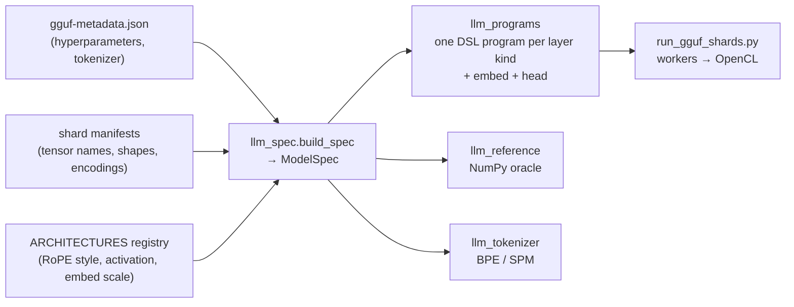

# Running any GGUF LLM on Ramanujan

`run_gguf_shards.py` runs a sharded GGUF model on Ramanujan workers. Each layer
executes as generated Ramanujan DSL compiled to OpenCL, and nothing in the
pipeline is specific to one model. The layer structure is read from the GGUF
tensor names and shapes. Hyperparameters come from the GGUF metadata. A small
registry supplies only the facts GGUF does not store.

Validated end to end on an 8 GB Apple M3 (4 shards, greedy decoding):

| Model | Arch | Quants in file | `--check-layers` (all layers, OpenCL vs NumPy) | Output ("The capital of France is") | Decode |
|---|---|---|---|---|---|
| TinyLlama 1.1B Chat Q4_K_M | `llama` | Q4_K, Q6_K, F32 | 5.8e-5 max rel. error, 22 layers | " Paris.\n\n2. B.C." (= llama.cpp) | ~0.7 s/token |
| Qwen2.5 0.5B Instruct Q4_K_M | `qwen2` | Q5_0, Q8_0, Q4_K, Q6_K, F32 | 2.3e-5, 24 layers | " Paris. It is the largest city in Europe and" | ~0.65 s/token |
| Qwen3.8 27B Q4_1 | `qwen35` | Q4_1, Q5_K, Q6_K, F32 | 1.2e-6, first 4 layers (2.0e-5 over all 64, see [QWEN35_GGUF.md](QWEN35_GGUF.md)) | " Paris.\nThe capital of Germany is" | ~7.6–9 s/token |

On every run, `--reference-token` picks the same token as the NumPy reference,
with a max logit error of 3e-5 to 8e-5.

### Checking against llama.cpp

`compare_llama_cpp.py` checks the NumPy reference itself against llama.cpp:

- **TinyLlama:** argmax matches at 6/6 prompt positions (logit correlation ≥ 0.993).
- **Qwen2.5:** argmax matches at 5/5 positions (correlation ≥ 0.996).
- **Tokenization:** matches llama.cpp and the HF `tokenizer.json` on both models.

Of four 10-token greedy generations, two are identical to llama.cpp:
TinyLlama/France and Qwen2.5 "What is 17 multiplied by 23?" (" 17 * 23 = 3").
The other two diverge late, and both times at a near-tie in llama.cpp's own
logits:

- **Qwen2.5/France, token 9:** " Europe" vs " the", a 0.19 gap on a 36-wide
  logit range. Evaluating the same prefix in one batch, llama.cpp also picks
  " Europe".
- **TinyLlama/math, token 5:** a 0.058 gap.

llama.cpp quantizes activations to 8 bits inside its matmuls. Ramanujan and the
reference keep them in float32.

## How it works



1. **Spec** (`llm_spec.py`). Each `blk.N.*` tensor set is classified as
   `attention` or `gated_deltanet` from its tensor suffixes. The optional
   pieces become flags, detected from which tensors exist and their shapes:
   - Q/K/V biases, per-head Q/K norms
   - output gate packed into `attn_q` (rows = 2·heads·head_dim)
   - fused `attn_qkv` and fused `ffn_up` (gate‖up)
   - post-attention and post-FFN norms
   - per-dimension `rope_freqs`
   - tied embeddings (no `output.weight`)

   Layers that share a mixer, the same flags and the same per-tensor encodings
   form one *kind*. Q4_K_M files mix quants across layers, so TinyLlama and
   Qwen2.5 each have two attention kinds, and Qwen3.8-27B has one DeltaNet kind
   and one attention kind.
2. **Programs** (`llm_programs.py`). One layer program per kind, plus the
   embedding-row decode and the head (final RMSNorm → output matvec → argmax).
   Matvec kernels decode GGUF blocks in-kernel with one intrinsic per quant.
   Array names equal the GGUF role (`attn_q`, `ffn_down`, `attn_q_bias`, …).
3. **Runner** (`run_gguf_shards.py`). Binds each layer's tensors by role,
   allocates its state (KV cache, or DeltaNet recurrent and conv state), and
   moves the hidden state from shard to shard. It supports the local JVM
   workers, `--homelab`, page-cache prefetch, `--check-layers` and
   `--reference-token`, as described in [QWEN35_GGUF.md](QWEN35_GGUF.md).
   `run_qwen35_shards.py` is kept as an alias.

### Architecture semantics registry

GGUF does not record three model-specific facts. The runner takes them from
`llm_spec.ARCHITECTURES`:

| Architecture (`general.architecture`) | RoPE | FFN activation | Embedding scale |
|---|---|---|---|
| `llama` (also Mistral 7B, SmolLM, TinyLlama GGUFs), and any unregistered arch | norm (adjacent pairs) | SiLU | 1 |
| `qwen2`, `qwen3`, `qwen35`, `phi3` | NeoX (halves) | SiLU | 1 |
| `gemma` | NeoX | GELU (tanh) | √dim |

For an architecture outside the registry, the runner assumes llama semantics,
prints that assumption in its `model` event, and accepts overrides:
`--rope-style {norm,neox} --activation {silu,gelu} --embed-scale {none,sqrt_dim}`.
Confirm the choice with `--check-layers` plus `compare_llama_cpp.py`.

### Supported pieces

| | Supported |
|---|---|
| Quant types (in-kernel decode) | F32, F16, Q4_0, Q4_1, Q5_0, Q5_1, Q8_0, Q4_K, Q5_K, Q6_K |
| Tokenizers | `tokenizer.ggml.model` = `gpt2` (byte-level BPE; pre-tokenizers default, gpt-2, llama3/llama-bpe, smollm, qwen2, qwen35) or `llama` (SentencePiece with byte fallback) |
| RoPE scaling | none, linear |
| Attention | GQA/MQA, causal, optional output gate |

These are rejected with an error naming the feature:

- mixture of experts (`ffn_gate_inp`)
- LayerNorm
- Mamba, MLA, RWKV
- logit soft-capping, and scalar multipliers (`embedding_scale`,
  `residual_scale`, `logit_scale`, e.g. Granite)
- YaRN/LongRoPE scaling
- sliding windows shorter than the context
- per-layer hyperparameter arrays
- any unrecognized layer tensor

The dequantizers in `llm_reference.py` match the llama.cpp `gguf` package
bit for bit on every supported type.

## Commands

From `ramanujan/sharded-llm` (build steps and flags are in
[QWEN35_GGUF.md](QWEN35_GGUF.md#commands)):

```sh
M=~/Desktop/ramanujan_oss/gguf-models/tinyllama-1.1b-chat-v1.0.Q4_K_M
# Shard and plan (from converter/)
(cd converter && PYTHONPATH=. python3 -m ramanujan_shards.emit_gguf --gguf $M.gguf --output-dir $M-shards --shards 4 \
  && PYTHONPATH=. python3 -m ramanujan_shards.gguf_ir_plan --package $M-shards --gguf $M.gguf --output-dir $M-ir-plan)
# Generate
python3 run_gguf_shards.py --package $M-shards --metadata $M-ir-plan/gguf-metadata.json \
  --prompt "The capital of France is" --max-new-tokens 10 --work-dir /tmp/gguf-run
# OpenCL vs NumPy, every layer; then NumPy vs llama.cpp (pip install llama-cpp-python gguf)
python3 run_gguf_shards.py ... --check-layers 22 --work-dir /tmp/gguf-check
python3 compare_llama_cpp.py --gguf $M.gguf --package $M-shards --metadata $M-ir-plan/gguf-metadata.json --greedy-tokens 10
# Tests
(cd converter && python3 -m unittest discover -s tests)
```

`converter/tests/test_llm_programs.py` runs the generated DSL through a Python
executor of the DSL (`dsl_simulator.py`) and compares it with the NumPy
reference. It covers synthetic llama, qwen2, qwen3, phi3, gemma, qwen35 and
unregistered-architecture models, plus every quant type. Mutation checks
confirmed that it catches wrong RoPE pairing, gating, DeltaNet scaling,
fused-tensor order and missing biases.

## Limitations

- **Precision.** Weights are dequantized to float32 in-kernel, and activations
  are never quantized. Output can therefore drift from llama.cpp at near-tied
  logits, as shown above.
- **Throughput.** Same per-token cost model as Qwen35: sequential layers, many
  small kernels, scalar dequantization. Small models are bound by per-kernel
  launch and protobuf overhead (~0.65 s/token for 0.5B–1.1B), not by weight
  bandwidth.
- **Sampling and templates.** Greedy text completion only, with no chat
  template.
