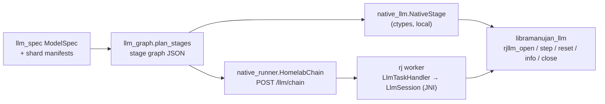

# Native LLM runtime (`libramanujan_llm`)

`--runtime native` runs sharded GGUF models on a dedicated OpenCL runtime built
for decoder-only LLMs, instead of generating Ramanujan DSL for every layer. It
takes the same shard packages and model spec as the DSL path (see
[GGUF_MODELS.md](GGUF_MODELS.md)), so any model the translator accepts
(llama, qwen2, qwen3, qwen35, phi3, gemma, and unregistered llama-style
architectures such as `ernie4_5` and `internlm2`) runs on it without
model-specific code.

### Speed against llama.cpp

The benchmark uses the prompt "The capital of France is", 10 greedy tokens,
and 4 shards. Each cell is decode ms/token (the average after the first token),
with tokens/s in brackets.

- **llama.cpp:** llama-cpp-python 0.3.35, after one warm-up run, with a
  timestamp taken when each token's logits are read. `llama_decode` returns
  before the GPU finishes, so timing only the decode call undercounts.
- **Ramanujan:** `run_gguf_shards.py --runtime native`, either local or via one
  `rj homelab` and one `rj worker --shared-filesystem`. The worker owns all 4
  shards, so each token is one `/llm/chain` task that returns only the chosen
  token. The homelab column is the median of 3 runs.

| Model | Arch | llama.cpp Metal | llama.cpp CPU (4 threads) | Ramanujan local | Ramanujan via `rj homelab` | Ramanujan output (10 tokens) |
|---|---|---|---|---|---|---|
| ERNIE 4.5 0.3B Q4_K_M | `ernie4_5` (unregistered) | 6.08 (164) | 4.48 (223)\* | 6.89 (145) | 9.00 (111) | "...\n\nA. FRANCE\n\n" |
| Qwen2.5 0.5B Q4_K_M | `qwen2` | 6.52 (153) | 7.54 (133)\* | 8.22 (122) | 10.9 (92) | " Paris. It is the largest city in Europe and" |
| Qwen3 0.6B Q4_K_M | `qwen3` | 6.92 (145) | 7.54 (133) | 10.1 (99) | 14.6 (69) | " Paris. The capital of France is also the capital" |
| Llama 3.2 1B Instruct Q4_K_M | `llama` | 10.5 (96) | 13.1 (76) | 12.9 (78) | 20.2 (49) | " Paris. The Eiffel Tower is a famous" |
| TinyLlama 1.1B Q4_K_M | `llama` | 9.27 (108) | 10.8 (92) | 13.8 (73) | 14.8 (68) | " Paris.\n\n2. B.C." |
| InternLM2.5 1.8B Q4_K_M | `internlm2` (unregistered) | 14.5 (69) | 17.7 (56) | 16.9 (59) | 21.7 (46) | " Paris. The French language is spoken in France and" |
| Gemma 1.1 2B Q4_K_M | `gemma` | 19.3 (52) | 26.4 (38) | 23.2 (43) | 28.2 (35) | " Paris.\n\nThe statement is false.\n\nThe" |
| Phi-3 mini 4k Q4 | `phi3` | 30.3 (33) | 38.4 (26)\* | 34.3 (29) | 42.9 (23) | " Paris.\n<\|assistant\|> That's correct! Paris" |
| Qwen3.8 27B Q4_1 | `qwen35` | does not fit | 20,389 (0.05) | 5,185 (0.19) | 5,193 (0.19) | " Paris.\nThe capital of Germany is Berlin." |

All 10 tokens are identical across every column except the cells marked
\*. There, llama.cpp's CPU backend diverges (at token 0, 8 and 4) because it
rounds activations to 8 bits inside its matmuls. llama.cpp on Metal matches
Ramanujan on every model.

- **Ramanujan local vs llama.cpp Metal:** 1.13–1.49x slower on the small
  models. Compared with llama.cpp CPU it is about even, and faster on the 1.8B
  to 3.8B models.
- **27B:** 16 GB of weights are read per token. Ramanujan streams them with its
  own loader threads at 5.2 s/token. llama.cpp
  memory-maps the file and spends its time in page faults at 20.4 s/token, so
  Ramanujan is **3.9x faster**. llama.cpp on Metal cannot hold the model
  (the working-set limit is ~5.7 GB).
- **Homelab adds 3–9 ms/token** on small models (it was 15–57 ms before
  chaining and argmax). Interleaved runs in one session, decode ms/token:

  | Model | Local | Homelab, per-stage steps + full logits (before) | Homelab, `/llm/chain` + argmax |
  |---|---|---|---|
  | ERNIE 0.3B | 6.33 | 33.8 | 9.00 |
  | Qwen2.5 0.5B | 8.22 | 38.7 | 10.9 |
  | Qwen3 0.6B | 9.33 | 39.8 | 14.6 |
  | Llama 3.2 1B | 12.9 | 44.6 | 20.2 |
  | TinyLlama 1.1B | 11.4 | 28.3 | 14.8 |
  | InternLM2.5 1.8B | 16.9 | 42.7 | 21.7 |
  | Gemma 2B | 23.6 | 80.4 | 28.2 |
  | Phi-3 mini | 33.8 | 50.2 | 42.9 |

  The "before" column comes from the earlier benchmark run. Tokens are
  identical in every run. Where the time went before (Gemma, 76 ms via
  homelab vs 23 ms local):
  - **GPU idle gaps: +21 ms.** Each of the 5 stage steps of a token waited a
    few ms for HTTP, and the GPU clocked down while idle (GPU time 24.5 →
    45.4 ms; an artificial 4 ms pause before each local stage does the same,
    24.5 → 48.9 ms). Chained, the stages run back to back on the worker and
    GPU time is back to ~24 ms.
  - **Head logits: ~16 ms.** The head returned all 256k logits as base64 JSON
    (1 MB). It now returns one token id.
  - **Hops: ~3 ms each,** 5 per token. Now there is one per token.

  What remains is one round trip through the homelab (~3 ms: the driver's
  POST, the worker's long poll and its `/task/complete`) plus GPU clock
  variance between tokens. On the 27B, homelab and local are equal
  (5,193 vs 5,185 ms/token).
- **First token:** local runs take 45–211 ms, and that includes the prompt
  prefill. Via homelab it is 178 ms–1.2 s, because the first step also makes
  the worker open its sessions and upload weights.
- **DSL path:** the same small models take 650–700 ms/token and the 27B
  7.6–9.1 s/token. The native runtime is 56–75x faster on small models.

`--check-layers` error and llama.cpp agreement per model are in
[GGUF_MODELS.md](GGUF_MODELS.md).

## Capacity-aware placement (opt-in)

With `--capacity-aware` (and `RAMANUJAN_CAPACITY_AWARE=1` on the services) the
orchestrator decides which device holds which layers, from the devices' memory
reports, and reuses shards a device already has cached. The algorithm, budgets,
plan lifecycle and API are documented in [ORCHESTRATION.md](../ORCHESTRATION.md).

## Design



**Stage graph** (`converter/ramanujan_shards/llm_graph.py`,
format `ramanujan-llm-graph/1`). The driver merges consecutive pieces on the
same shard into one stage (embedding, layers, and the head). For each layer the
graph records:

- the mixer: `attention` or `gated_deltanet`
- the spec flags: biases, Q/K norms, output gate, fused QKV/up, post norms
- every tensor's file, GGUF encoding and shape

It also carries the hyperparameters, `max_context`, the weights mode and the
stream settings. It carries no architecture name, so the runtime runs whatever
the spec describes.

**Session** (`ramanujan-native/native/llm/runtime.cpp`). One session per
stage. It owns:

- device weights
- KV caches and DeltaNet recurrent/conv state
- a RoPE table (computed in double)
- scratch buffers

`step(tokens | hidden, n, pos)` runs the stage for `n` tokens (batched prefill
or one decode token). It returns the last token's logits when the stage has
the head, and n × dim hidden values otherwise.

`pos` must equal the tokens already consumed, so a lost or reset session is
detected instead of silently producing garbage. A failure partway through a
step marks the session broken until `reset()`.

**Kernels** (`llm/kernels.cl`, embedded into the library at build time):

- Quantized `matvec` and fused `gateup` (gate/up matvec + activation) for F32,
  F16, Q4_0, Q4_1, Q5_0, Q5_1, Q8_0, Q4_K, Q5_K and Q6_K. They decode GGUF
  blocks in-kernel and fold the residual add into the output projection.
- `rmsnorm_rows`, `l2norm_rows`, `rope` (norm/NeoX, per-dim `rope_freqs`),
  `kv_store`, and one-pass causal GQA `attention` with an optional output gate.
- The DeltaNet kernels `dn_gate`, `dn_conv`, `dn_delta` and `dn_gatenorm`.
- `embed` (one quantized row → hidden), plus element-wise helpers.

The runtime calls only the OpenCL functions that the Android loader
(`opencl_loader.h`) provides, so the same code can target Android GPUs.

**Weights: `--weights {auto,resident,stream}`.**

- *resident*: uploads the stage's weights once, in 32 MB slices.
- *stream*: keeps only `--stream-depth` layers on the device. The weights
  are uploaded in step order by `--stream-threads` loader threads (each with
  its own queue) while earlier layers compute. Between steps, it prefetches
  the next step's first layers. On macOS, streamed reads bypass the page
  cache (`F_NOCACHE`), which was a consistent ~3% win on the 27B.
- *auto* (default): resident when every resident stage in the process fits in
  half of min(device memory, physical RAM); streamed otherwise.

27B streaming settings, measured:

| Loader threads | Depth | Page cache | s/token |
|---|---|---|---|
| 1 | 2 | | 6.33 |
| 2 | 2 | | 5.10–5.26 |
| 2 | 2 | bypassed | 4.94–4.98 |
| 3 | 4 | | 10.5 (memory thrash) |

**Distributed.** `--runtime native --homelab URL` sends each token through
all stages with one `POST /llm/chain`. The body is
`{stages: [{affinity, session, graph?, files?}], tokens, n, pos, output?}`;
a stage carries `graph` and `files` only on its session's first request.

- **Homelab.** Registers the files as fetchable, then walks the stages.
  Consecutive stages whose shards `AffinityTaskQueue` already assigns to the
  same worker become one task, with the first stage's shard as affinity. A
  stage with no owner yet goes out alone, so placement on the first request
  is the same as for single steps. The hidden state between groups is passed
  on as the base64 string the worker returned. The response is
  `{token | output, infos (one per stage), tasks, workers}`.
- **Worker.** `LlmTaskHandler` runs a chain task's stages back to back,
  passing the hidden state in memory. Each stage has its own `LlmSession`
  (JNI to `libramanujan_llm`), opened on its first request after every graph
  file is rewritten to its `WorkerBinaryCache` copy (or left as the server
  path with `--shared-filesystem`). Sessions stay open, so later requests
  carry only token ids, or hidden vectors (base64 little-endian float32)
  between workers.
- **Output.** With `output: "argmax"` the head returns only the token id
  (lowest index on ties, like `numpy.argmax`). The driver asks for full
  logits only for the first token with `--reference-token`.
- **Per-stage steps.** `--check-layers` needs every stage's hidden state, so
  it sends `POST /llm/step` once per stage instead
  (`{affinity, session, pos, n, tokens | hidden, output?}`).
- **Session limit.** `--llm-sessions N` (default 8) caps open sessions; the
  least recently used one is closed first.
- **Lost sessions.** A request with `pos > 0` for a session the worker does
  not have (the worker restarted, or the shard moved, including between the
  homelab grouping a chain and the worker polling it) fails with "not open
  on this worker". The driver has to restart generation.
- **Close.** `POST /llm/close` releases a session.

## Commands

```sh
# Build the library (from ramanujan/)
(cd ramanujan-native/native/build && cmake .. -DGPU_ENABLED=ON && make ramanujan_llm)

# Local (from ramanujan/sharded-llm); finds the library in ramanujan-native/native/build
M=~/Desktop/ramanujan_oss/gguf-models/qwen2.5-0.5b-instruct-q4_k_m
python3 run_gguf_shards.py --runtime native --package $M-shards --metadata $M-ir-plan/gguf-metadata.json \
  --prompt "What is 17 * 23?" --max-new-tokens 16 [--verbose] [--check-layers 24] [--reference-token]

# Distributed: copy libramanujan_llm.{dylib,so} into each worker's $RAMANUJAN_WS
rj homelab 8888
rj worker http://HOMELAB:8888 2 --cache ~/.ramanujan/worker-cache --max-shards 2
python3 run_gguf_shards.py --runtime native --homelab http://localhost:8888 --package ... --metadata ... --prompt ...

# Multi-turn: rendered chat turns (alternating, ending with the user turn) on stdin; the oldest
# user/assistant pairs are dropped until prompt + --max-new-tokens fits --max-context
echo '{"turns": ["<|im_start|>user\nHi, I am Ada.<|im_end|>\n", "<|im_start|>assistant\nHello Ada!<|im_end|>\n",
  "<|im_start|>user\nWhat is my name?<|im_end|>\n"], "suffix": "<|im_start|>assistant\n"}' |
  python3 run_gguf_shards.py --runtime native --package $M-shards --metadata $M-ir-plan/gguf-metadata.json \
  --prompt-turns - --max-new-tokens 16 --max-context 512    # prints {"event":"prompt-fit","droppedTurns":N}

# Tests
(cd converter && python3 -m unittest discover -s tests -p "test_native_llm.py")   # native vs NumPy parity
python3 -m unittest tests.test_native_homelab
(cd ../developer-console && mvn -q test -Dtest=LlmTaskHandlerTest,LlmChainGroupingTest)
```

`--work-dir` is not needed with `--runtime native`. `--verbose` prints one
`stage` event per stage step with `deviceMs` (native step time) and
`loadWaitMs` (time spent waiting for streamed weights). With `--homelab` it
also prints one `chain` event per token with the wall time, the number of
tasks and the workers that ran them.

| Environment variable | Default | Meaning |
|---|---|---|
| `RJLLM_DEVICE` | `gpu` | `gpu`, `cpu` or `any` OpenCL device |
| `RJLLM_WG` | 64 | Work-group size (halved until each kernel accepts it) |
| `RJLLM_KERNELS` | embedded | Load kernel source from a file (kernel development) |
| `RJLLM_RESIDENT_BUDGET` | ½ min(device, RAM) | Bytes that `--weights auto` may keep resident |
| `RJLLM_NOCACHE` | 1 | `0` keeps the page cache for streamed reads (macOS) |
| `RJLLM_LIBRARY` | in-repo build | Library path for the Python driver |
| `-Dramanujan.llmLibrary` | `ramanujan_llm` | Library name the worker JVM loads from `$RAMANUJAN_WS` |

`converter/tests/test_native_llm.py` runs every synthetic model from
`test_llm_programs.py`, with every quant type, through the library in both
resident and stream modes. For each piece and for the whole model, it
compares:

- batched prefill against token-by-token decode
- the result against the NumPy reference

It also checks position-mismatch errors and `reset()`.

## Limitations

- **Device.** Only OpenCL is supported. Linux, Android and Windows builds are
  untested. Page-cache bypass is macOS-only.
- **Homelab overhead.** About 3 ms per token for the round trip through the
  homelab, plus one more hop for each change of worker along the pipeline.
  Hidden states between workers travel through the homelab, not directly
  from worker to worker.
- **Sampling.** Only greedy decoding. Sampling would need the head to return
  top-k instead of the argmax.
- **No recovery.** A lost session is not rebuilt; the generation must restart
  from position 0.
- **Coverage.** Same as the translator ([GGUF_MODELS.md](GGUF_MODELS.md#supported-pieces)).
  Matrices need a multiple of 32 columns, and a tensor must fit in
  `CL_DEVICE_MAX_MEM_ALLOC_SIZE`.
