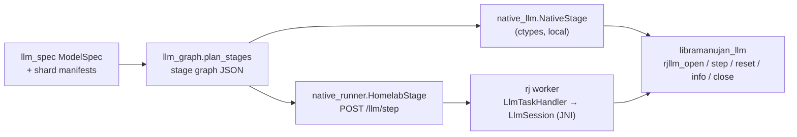

# Native LLM runtime (`libramanujan_llm`)

`--runtime native` runs sharded GGUF models on a dedicated OpenCL runtime built
for decoder-only LLMs, instead of generating Ramanujan DSL for every layer. It
takes the same shard packages and model spec as the DSL path (see
[GGUF_MODELS.md](GGUF_MODELS.md)), so any model the translator accepts
(llama, qwen2, qwen3, qwen35, phi3, gemma, and unregistered architectures with
overrides) runs on it without model-specific code.

Measured on one 8 GB Apple M3 (greedy decode, 4 shards):

| Model | `--check-layers` (all layers) | Output | DSL runtime | Native local | Native via `rj homelab` |
|---|---|---|---|---|---|
| Qwen2.5 0.5B Q4_K_M | 5.8e-6 max rel. error (DSL: 2.3e-5) | " Paris. It is the largest city in Europe and the second larg" | ~650 ms/token | 8.2–8.9 ms/token | 40 ms/token |
| TinyLlama 1.1B Q4_K_M | | " Paris.\n\n2. B.C. The capital of ancient Rome was Rome." | ~700 ms/token | 11.2–11.7 ms/token | 48 ms/token |
| Qwen3.8 27B Q4_1 | 3.1e-7 (first 4 layers) | "\n\nTo solve 17" ("What is 17 * 23?") | 7.6–9.1 s/token | 4.94–4.98 s/token (streamed) | 5.05–5.1 s/token |

- **Small models: about 56–75x faster** than the DSL path when running
  locally. The first 16 greedy tokens match llama.cpp on both models. Asked
  "What is 17 * 23?", Qwen2.5 works through 17 × 20 = 340 and has not
  printed the final product after 110 tokens. TinyLlama emits end-of-text
  immediately.
- **Homelab:** gives identical tokens, but each stage hop adds ~8 ms
  (HTTP, JSON, and the worker's long poll). The 0.5B head stage also returns
  600 KB of base64 logits per token.
- **27B:** needs 16 GB of weights read per token on an 8 GB machine, so it is
  bound by SSD reads and gains only ~1.5x. Faster decode needs the weights
  resident, which means spreading the shards across machines with enough
  combined RAM.

## Design



**Stage graph** (`converter/ramanujan_shards/llm_graph.py`,
format `ramanujan-llm-graph/1`). The driver merges consecutive pieces on the
same shard into one stage (embedding, layers, and the head). For each layer the
graph records:

- the mixer: `attention` or `gated_deltanet`
- the spec flags: biases, Q/K norms, output gate, fused QKV/up, post norms
- every tensor's file, GGUF encoding and shape

It also carries the hyperparameters, `max_context`, the weights mode and the
stream settings. It carries no architecture name, so the runtime runs whatever
the spec describes.

**Session** (`ramanujan-native/native/llm/runtime.cpp`). One session per
stage. It owns:

- device weights
- KV caches and DeltaNet recurrent/conv state
- a RoPE table (computed in double)
- scratch buffers

`step(tokens | hidden, n, pos)` runs the stage for `n` tokens (batched prefill
or one decode token). It returns the last token's logits when the stage has
the head, and n × dim hidden values otherwise.

`pos` must equal the tokens already consumed, so a lost or reset session is
detected instead of silently producing garbage. A failure partway through a
step marks the session broken until `reset()`.

**Kernels** (`llm/kernels.cl`, embedded into the library at build time):

- Quantized `matvec` and fused `gateup` (gate/up matvec + activation) for F32,
  F16, Q4_0, Q4_1, Q5_0, Q5_1, Q8_0, Q4_K, Q5_K and Q6_K. They decode GGUF
  blocks in-kernel and fold the residual add into the output projection.
- `rmsnorm_rows`, `l2norm_rows`, `rope` (norm/NeoX, per-dim `rope_freqs`),
  `kv_store`, and one-pass causal GQA `attention` with an optional output gate.
- The DeltaNet kernels `dn_gate`, `dn_conv`, `dn_delta` and `dn_gatenorm`.
- `embed` (one quantized row → hidden), plus element-wise helpers.

The runtime calls only the OpenCL functions that the Android loader
(`opencl_loader.h`) provides, so the same code can target Android GPUs.

**Weights: `--weights {auto,resident,stream}`.**

- *resident*: uploads the stage's weights once, in 32 MB slices.
- *stream*: keeps only `--stream-depth` layers on the device. The weights
  are uploaded in step order by `--stream-threads` loader threads (each with
  its own queue) while earlier layers compute. Between steps, it prefetches
  the next step's first layers. On macOS, streamed reads bypass the page
  cache (`F_NOCACHE`), which was a consistent ~3% win on the 27B.
- *auto* (default): resident when every resident stage in the process fits in
  half of min(device memory, physical RAM); streamed otherwise.

27B streaming settings, measured:

| Loader threads | Depth | Page cache | s/token |
|---|---|---|---|
| 1 | 2 | | 6.33 |
| 2 | 2 | | 5.10–5.26 |
| 2 | 2 | bypassed | 4.94–4.98 |
| 3 | 4 | | 10.5 (memory thrash) |

**Distributed.** `--runtime native --homelab URL` sends each stage step to
`POST /llm/step`. The body is `{affinity, session, pos, n, tokens | hidden}`,
and only the first request of a session adds `graph` and `files`:

- **Homelab.** Registers the files as fetchable, then queues a task with the
  shard as affinity. `AffinityTaskQueue` placement is unchanged, so a shard
  keeps running on the worker that owns it. The request blocks until the
  worker reports.
- **Worker.** `LlmTaskHandler` opens an `LlmSession` (JNI to
  `libramanujan_llm`) on the first request. It first rewrites every graph
  file to its `WorkerBinaryCache` copy, or keeps the server paths with
  `--shared-filesystem`. The session stays open, so later steps carry only
  token ids or hidden vectors (base64 little-endian float32).
- **Session limit.** `--llm-sessions N` (default 8) caps open sessions; the
  least recently used one is closed first.
- **Lost sessions.** A step with `pos > 0` for a session the worker does not
  have (worker restarted or the shard moved) fails with "not open on this
  worker". The driver has to restart generation.
- **Close.** `POST /llm/close` releases a session.

## Commands

```sh
# Build the library (from ramanujan/)
(cd ramanujan-native/native/build && cmake .. -DGPU_ENABLED=ON && make ramanujan_llm)

# Local (from ramanujan/sharded-llm); finds the library in ramanujan-native/native/build
M=~/Desktop/ramanujan_oss/gguf-models/qwen2.5-0.5b-instruct-q4_k_m
python3 run_gguf_shards.py --runtime native --package $M-shards --metadata $M-ir-plan/gguf-metadata.json \
  --prompt "What is 17 * 23?" --max-new-tokens 16 [--verbose] [--check-layers 24] [--reference-token]

# Distributed: copy libramanujan_llm.{dylib,so} into each worker's $RAMANUJAN_WS
rj homelab 8888
rj worker http://HOMELAB:8888 2 --cache ~/.ramanujan/worker-cache --max-shards 2
python3 run_gguf_shards.py --runtime native --homelab http://localhost:8888 --package ... --metadata ... --prompt ...

# Tests
(cd converter && python3 -m unittest discover -s tests -p "test_native_llm.py")   # native vs NumPy parity
python3 -m unittest tests.test_native_homelab
(cd ../developer-console && mvn -q test -Dtest=LlmTaskHandlerTest)
```

`--work-dir` is not needed with `--runtime native`. `--verbose` prints one
`stage` event per stage step with `deviceMs` (native step time) and
`loadWaitMs` (time spent waiting for streamed weights).

| Environment variable | Default | Meaning |
|---|---|---|
| `RJLLM_DEVICE` | `gpu` | `gpu`, `cpu` or `any` OpenCL device |
| `RJLLM_WG` | 64 | Work-group size (halved until each kernel accepts it) |
| `RJLLM_KERNELS` | embedded | Load kernel source from a file (kernel development) |
| `RJLLM_RESIDENT_BUDGET` | ½ min(device, RAM) | Bytes that `--weights auto` may keep resident |
| `RJLLM_NOCACHE` | 1 | `0` keeps the page cache for streamed reads (macOS) |
| `RJLLM_LIBRARY` | in-repo build | Library path for the Python driver |
| `-Dramanujan.llmLibrary` | `ramanujan_llm` | Library name the worker JVM loads from `$RAMANUJAN_WS` |

`converter/tests/test_native_llm.py` runs every synthetic model from
`test_llm_programs.py`, with every quant type, through the library in both
resident and stream modes. For each piece and for the whole model, it
compares:

- batched prefill against token-by-token decode
- the result against the NumPy reference

It also checks position-mismatch errors and `reset()`.

## Limitations

- **Device.** Only OpenCL is supported, and it has been validated only on Apple
  M3 GPUs. Linux, Android and Windows builds are untested. Page-cache bypass is
  macOS-only.
- **Homelab overhead.** Each stage hop costs ~8 ms, and full logits travel as
  JSON/base64. The driver samples greedily, so returning the argmax (or top-k)
  from the head would remove most of that.
- **No recovery.** A lost session is not rebuilt; the generation must restart
  from position 0.
- **Coverage.** Same as the translator ([GGUF_MODELS.md](GGUF_MODELS.md#supported-pieces)).
  Matrices need a multiple of 32 columns, and a tensor must fit in
  `CL_DEVICE_MAX_MEM_ALLOC_SIZE`.
