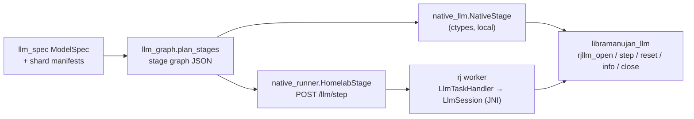

# Native LLM runtime (`libramanujan_llm`)

`--runtime native` runs sharded GGUF models on a dedicated OpenCL runtime built
for decoder-only LLMs, instead of generating Ramanujan DSL for every layer. It
takes the same shard packages and model spec as the DSL path (see
[GGUF_MODELS.md](GGUF_MODELS.md)), so any model the translator accepts
(llama, qwen2, qwen3, qwen35, phi3, gemma, and unregistered llama-style
architectures such as `ernie4_5` and `internlm2`) runs on it without
model-specific code.

### Speed against llama.cpp

Measured on one 8 GB Apple M3. Prompt "The capital of France is", 10 greedy
tokens, 4 shards. Each cell is decode ms/token (the average after the first
token), with tokens/s in brackets.

- **llama.cpp:** llama-cpp-python 0.3.35, after one warm-up run, with a
  timestamp taken when each token's logits are read. `llama_decode` returns
  before the GPU finishes, so timing only the decode call undercounts.
- **Ramanujan:** `run_gguf_shards.py --runtime native`, either local or via one
  `rj homelab` and one `rj worker --shared-filesystem` on the same machine.
  The worker owns all 4 shards, so every token makes 4 HTTP hops.

| Model | Arch | llama.cpp Metal | llama.cpp CPU (4 threads) | Ramanujan local | Ramanujan via `rj homelab` | Ramanujan output (10 tokens) |
|---|---|---|---|---|---|---|
| ERNIE 4.5 0.3B Q4_K_M | `ernie4_5` (unregistered) | 6.08 (164) | 4.48 (223)\* | 6.89 (145) | 33.8 (30) | "...\n\nA. FRANCE\n\n" |
| Qwen2.5 0.5B Q4_K_M | `qwen2` | 6.52 (153) | 7.54 (133)\* | 8.22 (122) | 38.7 (26) | " Paris. It is the largest city in Europe and" |
| Qwen3 0.6B Q4_K_M | `qwen3` | 6.92 (145) | 7.54 (133) | 10.1 (99) | 39.8 (25) | " Paris. The capital of France is also the capital" |
| Llama 3.2 1B Instruct Q4_K_M | `llama` | 10.5 (96) | 13.1 (76) | 12.9 (78) | 44.6 (22) | " Paris. The Eiffel Tower is a famous" |
| TinyLlama 1.1B Q4_K_M | `llama` | 9.27 (108) | 10.8 (92) | 13.8 (73) | 28.3 (35) | " Paris.\n\n2. B.C." |
| InternLM2.5 1.8B Q4_K_M | `internlm2` (unregistered) | 14.5 (69) | 17.7 (56) | 16.9 (59) | 42.7 (23) | " Paris. The French language is spoken in France and" |
| Gemma 1.1 2B Q4_K_M | `gemma` | 19.3 (52) | 26.4 (38) | 23.2 (43) | 80.4 (12) | " Paris.\n\nThe statement is false.\n\nThe" |
| Phi-3 mini 4k Q4 | `phi3` | 30.3 (33) | 38.4 (26)\* | 34.3 (29) | 50.2 (20) | " Paris.\n<\|assistant\|> That's correct! Paris" |
| Qwen3.8 27B Q4_1 | `qwen35` | does not fit | 20,389 (0.05) | 5,185 (0.19) | 5,243 (0.19) | " Paris.\nThe capital of Germany is Berlin." |

All 10 tokens are identical across every column except the cells marked
\*. There, llama.cpp's CPU backend diverges (at token 0, 8 and 4) because it
rounds activations to 8 bits inside its matmuls. llama.cpp on Metal matches
Ramanujan on every model.

- **Ramanujan local vs llama.cpp Metal:** 1.13–1.49x slower on the small
  models. Compared with llama.cpp CPU it is about even, and faster on the 1.8B
  to 3.8B models.
- **27B:** on an 8 GB machine, 16 GB of weights are read per token. Ramanujan
  streams them with its own loader threads at 5.2 s/token. llama.cpp
  memory-maps the file and spends its time in page faults at 20.4 s/token, so
  Ramanujan is **3.9x faster**. llama.cpp on Metal cannot hold the model
  (the working-set limit is ~5.7 GB).
- **Homelab adds 15–57 ms/token.** The extra cost grows with vocabulary size,
  because the head stage returns the full logits as base64 JSON:
  - +15 ms for TinyLlama and Phi-3 (32k vocabulary)
  - +30 ms for Qwen and Llama 3.2 (128k–152k)
  - +57 ms for Gemma (256k)

  On the 27B the overhead is 1%. Returning only the chosen token from the head
  would remove most of it on small models (see Limitations).
- **First token:** local runs take 45–211 ms, and that includes the prompt
  prefill. Via homelab it is 178 ms–1.2 s, because the first step also makes
  the worker open its sessions and upload weights.
- **DSL path:** the same small models take 650–700 ms/token and the 27B
  7.6–9.1 s/token. The native runtime is 56–75x faster on small models.

`--check-layers` error and llama.cpp agreement per model are in
[GGUF_MODELS.md](GGUF_MODELS.md).

## Design



**Stage graph** (`converter/ramanujan_shards/llm_graph.py`,
format `ramanujan-llm-graph/1`). The driver merges consecutive pieces on the
same shard into one stage (embedding, layers, and the head). For each layer the
graph records:

- the mixer: `attention` or `gated_deltanet`
- the spec flags: biases, Q/K norms, output gate, fused QKV/up, post norms
- every tensor's file, GGUF encoding and shape

It also carries the hyperparameters, `max_context`, the weights mode and the
stream settings. It carries no architecture name, so the runtime runs whatever
the spec describes.

**Session** (`ramanujan-native/native/llm/runtime.cpp`). One session per
stage. It owns:

- device weights
- KV caches and DeltaNet recurrent/conv state
- a RoPE table (computed in double)
- scratch buffers

`step(tokens | hidden, n, pos)` runs the stage for `n` tokens (batched prefill
or one decode token). It returns the last token's logits when the stage has
the head, and n × dim hidden values otherwise.

`pos` must equal the tokens already consumed, so a lost or reset session is
detected instead of silently producing garbage. A failure partway through a
step marks the session broken until `reset()`.

**Kernels** (`llm/kernels.cl`, embedded into the library at build time):

- Quantized `matvec` and fused `gateup` (gate/up matvec + activation) for F32,
  F16, Q4_0, Q4_1, Q5_0, Q5_1, Q8_0, Q4_K, Q5_K and Q6_K. They decode GGUF
  blocks in-kernel and fold the residual add into the output projection.
- `rmsnorm_rows`, `l2norm_rows`, `rope` (norm/NeoX, per-dim `rope_freqs`),
  `kv_store`, and one-pass causal GQA `attention` with an optional output gate.
- The DeltaNet kernels `dn_gate`, `dn_conv`, `dn_delta` and `dn_gatenorm`.
- `embed` (one quantized row → hidden), plus element-wise helpers.

The runtime calls only the OpenCL functions that the Android loader
(`opencl_loader.h`) provides, so the same code can target Android GPUs.

**Weights: `--weights {auto,resident,stream}`.**

- *resident*: uploads the stage's weights once, in 32 MB slices.
- *stream*: keeps only `--stream-depth` layers on the device. The weights
  are uploaded in step order by `--stream-threads` loader threads (each with
  its own queue) while earlier layers compute. Between steps, it prefetches
  the next step's first layers. On macOS, streamed reads bypass the page
  cache (`F_NOCACHE`), which was a consistent ~3% win on the 27B.
- *auto* (default): resident when every resident stage in the process fits in
  half of min(device memory, physical RAM); streamed otherwise.

27B streaming settings, measured:

| Loader threads | Depth | Page cache | s/token |
|---|---|---|---|
| 1 | 2 | | 6.33 |
| 2 | 2 | | 5.10–5.26 |
| 2 | 2 | bypassed | 4.94–4.98 |
| 3 | 4 | | 10.5 (memory thrash) |

**Distributed.** `--runtime native --homelab URL` sends each stage step to
`POST /llm/step`. The body is `{affinity, session, pos, n, tokens | hidden}`,
and only the first request of a session adds `graph` and `files`:

- **Homelab.** Registers the files as fetchable, then queues a task with the
  shard as affinity. `AffinityTaskQueue` placement is unchanged, so a shard
  keeps running on the worker that owns it. The request blocks until the
  worker reports.
- **Worker.** `LlmTaskHandler` opens an `LlmSession` (JNI to
  `libramanujan_llm`) on the first request. It first rewrites every graph
  file to its `WorkerBinaryCache` copy, or keeps the server paths with
  `--shared-filesystem`. The session stays open, so later steps carry only
  token ids or hidden vectors (base64 little-endian float32).
- **Session limit.** `--llm-sessions N` (default 8) caps open sessions; the
  least recently used one is closed first.
- **Lost sessions.** A step with `pos > 0` for a session the worker does not
  have (worker restarted or the shard moved) fails with "not open on this
  worker". The driver has to restart generation.
- **Close.** `POST /llm/close` releases a session.

## Commands

```sh
# Build the library (from ramanujan/)
(cd ramanujan-native/native/build && cmake .. -DGPU_ENABLED=ON && make ramanujan_llm)

# Local (from ramanujan/sharded-llm); finds the library in ramanujan-native/native/build
M=~/Desktop/ramanujan_oss/gguf-models/qwen2.5-0.5b-instruct-q4_k_m
python3 run_gguf_shards.py --runtime native --package $M-shards --metadata $M-ir-plan/gguf-metadata.json \
  --prompt "What is 17 * 23?" --max-new-tokens 16 [--verbose] [--check-layers 24] [--reference-token]

# Distributed: copy libramanujan_llm.{dylib,so} into each worker's $RAMANUJAN_WS
rj homelab 8888
rj worker http://HOMELAB:8888 2 --cache ~/.ramanujan/worker-cache --max-shards 2
python3 run_gguf_shards.py --runtime native --homelab http://localhost:8888 --package ... --metadata ... --prompt ...

# Tests
(cd converter && python3 -m unittest discover -s tests -p "test_native_llm.py")   # native vs NumPy parity
python3 -m unittest tests.test_native_homelab
(cd ../developer-console && mvn -q test -Dtest=LlmTaskHandlerTest)
```

`--work-dir` is not needed with `--runtime native`. `--verbose` prints one
`stage` event per stage step with `deviceMs` (native step time) and
`loadWaitMs` (time spent waiting for streamed weights).

| Environment variable | Default | Meaning |
|---|---|---|
| `RJLLM_DEVICE` | `gpu` | `gpu`, `cpu` or `any` OpenCL device |
| `RJLLM_WG` | 64 | Work-group size (halved until each kernel accepts it) |
| `RJLLM_KERNELS` | embedded | Load kernel source from a file (kernel development) |
| `RJLLM_RESIDENT_BUDGET` | ½ min(device, RAM) | Bytes that `--weights auto` may keep resident |
| `RJLLM_NOCACHE` | 1 | `0` keeps the page cache for streamed reads (macOS) |
| `RJLLM_LIBRARY` | in-repo build | Library path for the Python driver |
| `-Dramanujan.llmLibrary` | `ramanujan_llm` | Library name the worker JVM loads from `$RAMANUJAN_WS` |

`converter/tests/test_native_llm.py` runs every synthetic model from
`test_llm_programs.py`, with every quant type, through the library in both
resident and stream modes. For each piece and for the whole model, it
compares:

- batched prefill against token-by-token decode
- the result against the NumPy reference

It also checks position-mismatch errors and `reset()`.

## Limitations

- **Device.** Only OpenCL is supported, and it has been validated only on Apple
  M3 GPUs. Linux, Android and Windows builds are untested. Page-cache bypass is
  macOS-only.
- **Homelab overhead.** Each stage hop costs ~3 ms (HTTP, queue, the worker's
  long poll). The head hop also returns the full logits as base64 JSON: 4 bytes
  per vocabulary entry before base64, so 128 KB for a 32k vocabulary and 1 MB
  for Gemma's 256k. The driver samples greedily, so
  returning the argmax (or top-k) from the head would remove most of that.
- **No recovery.** A lost session is not rebuilt; the generation must restart
  from position 0.
- **Coverage.** Same as the translator ([GGUF_MODELS.md](GGUF_MODELS.md#supported-pieces)).
  Matrices need a multiple of 32 columns, and a tensor must fit in
  `CL_DEVICE_MAX_MEM_ALLOC_SIZE`.
