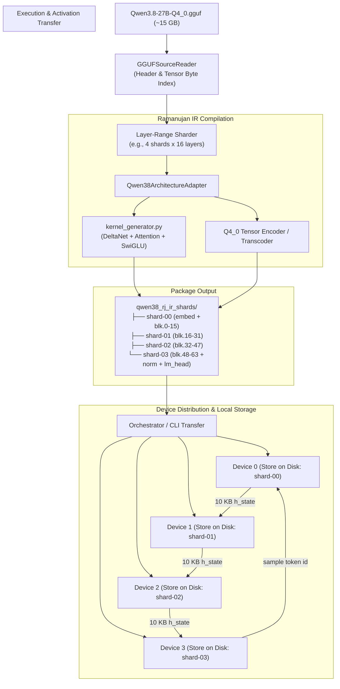

# Running Qwen 3.8 27B 4-bit (GGUF) on Ramanujan Sharded LLM

## 1. Overview & Goals

This plan details the architecture and roadmap for enabling **Ramanujan** to run **Qwen 3.8 27B 4-bit Quantized (`Qwen3.8-27B-Q4_0.gguf`)**.

### Key Model Specifications
* **Source Repository:** [`unsloth/Qwen3.8-27B-GGUF`](https://huggingface.co/unsloth/Qwen3.8-27B-GGUF)
* **Target File:** `Qwen3.8-27B-Q4_0.gguf` (~15.2 GB)
* **Total Layers:** 64 decoder layers
* **Hybrid Architecture:**
  * **48 Gated DeltaNet layers** (linear attention / recurrent state $S_t = S_{t-1} + v_t k_t^T$, constant $O(1)$ memory per token).
  * **16 full causal self-attention layers** (every 4th layer has standard KV cache).
* **Dimensions:** Hidden size $D = 5120$, intermediate size $17408$ (SwiGLU MLP), vocabulary size $248320$.
* **Intermediate Activation Size:** $5120 \times 2\text{ bytes} \approx 10\text{ KB}$ per token.

---

## 2. How GGUF Sharding Works

1. It parses the remote or local GGUF file header and tensor directory.
2. It partitions the 64 layers into contiguous slices across participating devices.
3. Each participant fetches **only the byte offsets corresponding to its assigned layers** (via HTTP Range headers or local slice reading) and caches them on disk.
4. During inference, devices do not transfer weights; they only pass the **10 KB activation vector** ($h_{\text{state}}$) down the pipeline.

Ramanujan adapts this design to its native compiled runtime (Java Orchestrator/Worker $\leftrightarrow$ JNI $\leftrightarrow$ C++ / OpenCL), replacing monolithic execution with distributed or sequential Ramanujan IR shards.

---

## 3. End-to-End System Architecture



---

## 4. Technical Implementation Phases

### Phase 1: GGUF Source Ingestion (`GGUFSourceReader`)
* **Location:** `ramanujan/sharded-llm/converter/ramanujan_shards/gguf_source.py`
* **Constant-Memory Sharding (RAM << GGUF Size):**
  * **Can a machine with 4 GB RAM shard a 15 GB+ GGUF? Yes, absolutely.**
  * In GGUF, all structural metadata and tensor offset tables are packed in the file **header** (typically < 10 MB).
  * `GGUFSourceReader` reads *only* the header into RAM.
  * Tensors are extracted via streaming file slicing (`_TensorSlice` with `seek` and buffered chunks, e.g. 4 MB read/write buffer) or `mmap`:
    $$\text{RAM Usage} \le \text{Header Size} + \text{Chunk Buffer} \approx 20\text{–}50\text{ MB}$$
  * A 2 GB or 4 GB RAM machine can shard 15 GB, 70 GB, or even 500 GB models without out-of-memory errors.
  * For remote sharding, HTTP `Range: bytes=X-Y` requests fetch only the slices assigned to that device directly to disk without ever downloading or storing the full monolithic file.
* **Functionality:**
  * Implement the `SourceReader` interface:
    * `metadata()`: Parse GGUF metadata key-value pairs (architecture, context length, layer types, head dimensions).
    * `tensor_names()`: Enumerate all tensors (`blk.0.*`, `token_embd.weight`, `output.weight`, etc.).
    * `tensor_metadata(name)`: Extract tensor shape, data type (`GGML_TYPE_Q4_0`, `GGML_TYPE_F32`), and absolute file offset.
    * `open_tensor(name)`: Return a seekable binary stream or memory-mapped slice (`mmap`) for each tensor without loading the entire 15 GB file into RAM.

### Phase 2: Qwen 3.8 Architecture Adapter (`Qwen38ArchitectureAdapter`)
* **Location:** `ramanujan/sharded-llm/converter/ramanujan_shards/qwen_adapter.py`
* **Functionality:**
  * Define the DAG stages across the 64 decoder layers:
    * Standard partition: 4 shards $\times$ 16 layers each (or 8 shards $\times$ 8 layers for more constrained nodes).
    * **Shard 0:** `token_embd.weight` + layers $0 \dots 15$.
    * **Intermediate Shards:** Assigned decoder layer ranges.
    * **Final Shard:** Assigned decoder layers + `output_norm.weight` + `output.weight` (LM Head).
  * Handle the hybrid layer definitions:
    * 48 Gated DeltaNet layers: recurrent state tensor ($S_t \in \mathbb{R}^{H \times D_k \times D_v}$) allocated per layer.
    * 16 full-attention layers: standard KV cache allocated per layer ($16 \times 4 \text{ KV heads} \times 256 \text{ head\_dim}$).

### Phase 3: Tensor Encoding & Dequantization Strategy
* **Approach A: Transcode to Ramanujan Packed 4-bit Format**
  * Unpack GGUF Q4_0 blocks (32 4-bit nibbles + 1 fp16 scale) into Ramanujan's current representation (6 nibbles per float32 + row scales).
  * Pros: Immediate compatibility with existing `matmul_4bit_GPU_2` kernel.
  * Cons: Increases file size from ~15 GB to ~25 GB and adds conversion overhead.
* **Approach B (Target): Direct Native Q4_0 OpenCL Kernel**
  * Add `matmul_q4_0_GPU` in `ramanujan/ramanujan-native/native/`.
  * Preserves exact GGUF Q4_0 compactness: 18 bytes per 32 weights (16 bytes nibbles + 2 bytes fp16 scale).
  * Yields $\approx 30\%$ memory bandwidth savings and zero unpacking overhead.

### Phase 4: Ramanujan IR Generator for Hybrid Layers
* **Location:** `ramanujan/sharded-llm/converter/ramanujan_shards/qwen_kernel_generator.py`
* **Generated Programs:**
  * `programs/prefill.py`: Processes prompt tokens and populates both the recurrent DeltaNet states and the 16-layer KV caches.
  * `programs/decode.py`: Executes autoregressive decode step for the assigned layer range.
  * `programs/decode_resident.py`: Keeps mutable states (recurrent states + KV cache) in native memory across tokens, taking only the incoming 10 KB `h_state` and outputting the updated 10 KB `h_state`.

### Phase 5: Distribution & Memory Lifecycle Management

The requirement: *"send them to devices, they store it and takes into memory as required"*.

#### 1. Device Storage
* Each worker device receives its assigned shard package:
  ```
  ~/.ramanujan/models/qwen3.8-27b/shard-01/
  ├── manifest.json
  ├── weights/
  │   ├── blk.16.*.bin
  │   └── ...
  └── programs/
      ├── prefill.py
      └── decode_resident.py
  ```
* Stored persistently on local NVMe / SSD.

#### 2. Memory Lifecycle
* **Distributed Pipeline Mode (Multi-Device, Primary):**
  * Each device maps only its assigned shard (~3.8 GB) into active memory.
  * Weight buffers remain resident in GPU/VRAM.
  * Each device processes incoming activations and sends the 10 KB vector over TCP/gRPC/WebRTC to the next device.
  * **Expected Throughput: 8–12 tokens/sec**.
* **Single-Device Sequential Sharding Mode (Fallback):**
  * A single resource-constrained device holds all 4 shards on disk.
  * It executes Shard 0 $\rightarrow$ unloads weights via `resetShardSession` and `madvise(MADV_DONTNEED)` $\rightarrow$ loads Shard 1, etc.
  * Note: Streaming 15 GB sequentially from SSD for 1 token is storage-bandwidth-bound ($\le 0.5$ tok/s), which is why distributed multi-device pipelining is the intended operational target for 27B models.

---

## 5. Execution Roadmap

| Milestone | Deliverables | Validation Criteria |
|---|---|---|
| **M1: GGUF Reader** | `GGUFSourceReader`, unit tests reading `Qwen3.8-27B-Q4_0.gguf` | Correct parsing of metadata, shapes, and tensor offsets. |
| **M2: Sharder & Adapter** | `Qwen38ArchitectureAdapter`, manifest generation for 4 shards | Verification tool confirms contiguous layer coverage ($0\dots 63$) and valid checksums. |
| **M3: IR Kernel Generator** | `qwen_kernel_generator.py` (DeltaNet + Attention + SwiGLU) | Generated Ramanujan DSL programs parse cleanly with `ast.parse` and compile to valid IR. |
| **M4: Native Q4_0 Kernel** | OpenCL `matmul_q4_0_GPU` in `ramanujan-native` | Bit-exact numerical equivalence against llama.cpp reference output. |
| **M5: Shard Runner & Pipeline** | `run_qwen_shards.py` with multi-process or networked worker coordination | Successful 10-token generation across 4 local or networked workers. |
