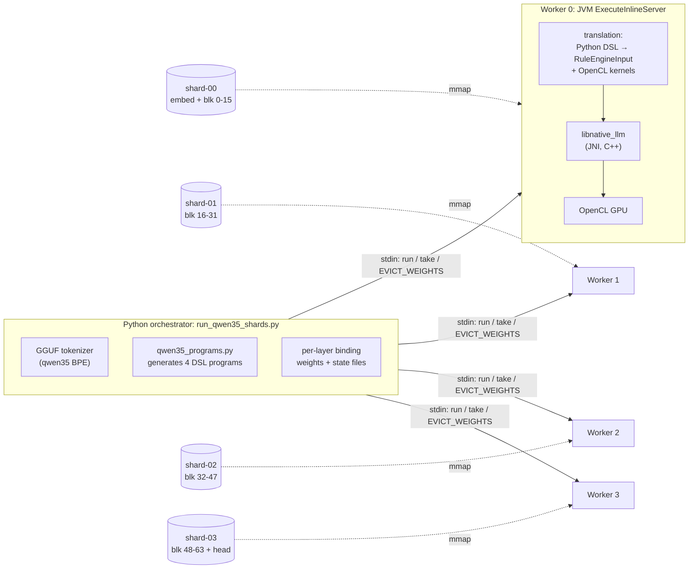
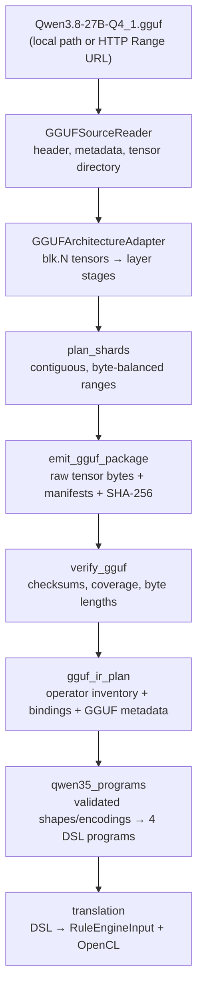
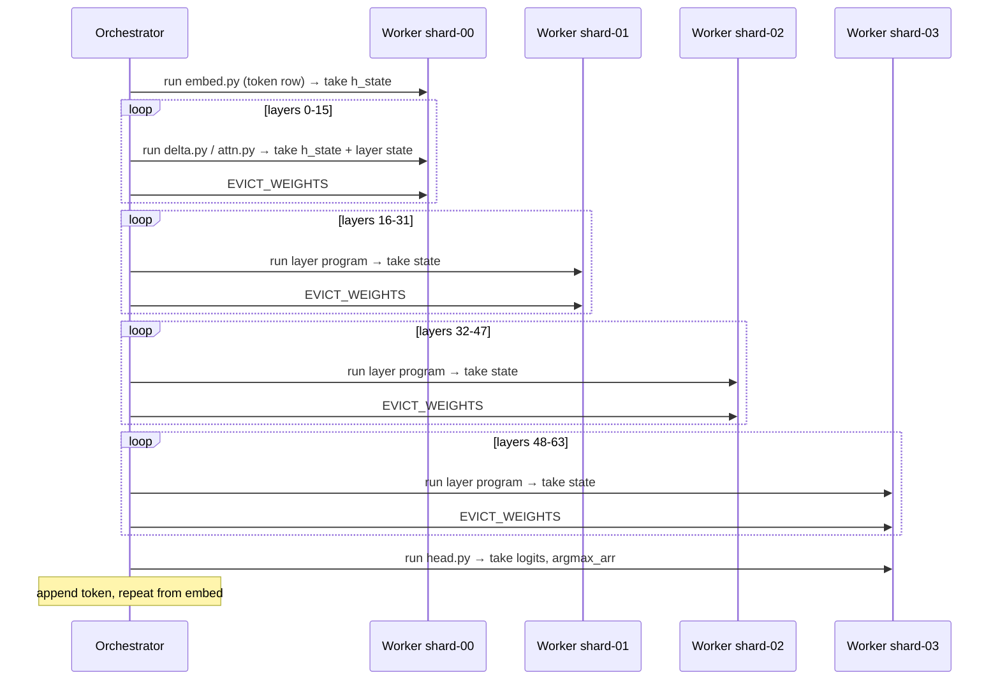

# Qwen35 GGUF on Ramanujan: Sharded Inference

Qwen3.8-27B (`qwen35` architecture, 16.3 GiB Q4_1 GGUF) is split into four
shards. Each shard is executed by its own Ramanujan worker, and every layer runs
as generated Ramanujan DSL compiled to OpenCL kernels. On an 8 GB Apple M3:

```
prompt:  "The capital of France is"
output:  " Paris.\nThe capital of Germany is"
speed:   ~16 s/token (greedy), every worker below 300 MB RSS
```

The hidden state after all 64 layers matches an independent NumPy reference
within 2e-5 relative error, and the output head selects the same token (max
logit error 5e-5). See [Validation](#validation).

Contents: [Infrastructure](#infrastructure) ·
[GGUF → shards → IR](#converting-gguf-into-ramanujan-shards-and-ir) ·
[How shards run](#how-the-shards-run) · [Validation](#validation) ·
[Commands](#commands) · [Limitations](#limitations) · [File map](#file-map)

## Infrastructure



| Layer | Component | Role |
|---|---|---|
| Orchestration | `sharded-llm/run_qwen35_shards.py` | Tokenizes input, owns the shard → worker mapping, binds each layer's tensors and state, moves the hidden state between workers, and runs the decode loop. |
| Program generation | `converter/ramanujan_shards/qwen35_programs.py` | Emits the embedding, DeltaNet-layer, attention-layer, and output-head programs from GGUF metadata. |
| Worker | `developer-console` `ExecuteInlineServer` | A persistent JVM per shard. It compiles each program once (cached by input shapes), then executes it, returns arrays, and evicts weights on command. |
| Translation | `middleware/translation` | Converts `_GPU_N` Python functions to OpenCL C. The `GGUF_Q4_1_VALUE`, `GGUF_Q5_K_VALUE`, and `GGUF_Q6_K_VALUE` intrinsics decode raw GGUF blocks inside the kernel. |
| Native runtime | `ramanujan-native` `libnative_llm` | Maps binary tensor files, manages OpenCL buffers (`LOAD_MEM`, `GPU_SYNC`, `RELEASE_MEM`), dispatches kernels, and writes `RETURN` arrays to files. |
| Storage | Shard directories | Raw GGUF tensor bytes, one `.bin` file per tensor, with SHA-256 checksums. |

The four workers run as separate processes on one machine. They communicate
only through the orchestrator, which passes a 5120-float hidden state (20 KB)
from worker to worker. Placing each worker on a different device changes only
how that vector travels (see [Limitations](#limitations)).

## Converting GGUF into Ramanujan shards and IR



### 1. Reading the GGUF without loading it

`GGUFSourceReader` parses only the GGUF header: metadata key/values, the tensor
directory (name, shape, GGML type, offset), and alignment. It computes each
tensor's exact byte length from its GGML type. Supported block types are
F32/F16, Q4_0, Q4_1, Q5_K, Q6_K, and Q8_0; any other type is carried through
as opaque bytes. Tensor payloads are streamed in 4 MiB chunks, so sharding the
16 GiB file needs only tens of MB of RAM. An `http(s)://` source is read with
`Range` requests, and `--shard-index N` fetches only that shard's byte ranges.

### 2. Grouping tensors into shards

`GGUFArchitectureAdapter` groups every `blk.N.*` tensor under layer `N`.
`plan_shards` then assigns contiguous layer ranges, balanced by byte size.
Global tensors follow the model's data flow: `token_embd.weight` goes to the
first shard, and `output_norm.weight` and `output.weight` go to the last.
Every tensor is assigned exactly once.

| Shard | Layers | Extra tensors | Tensors | Size |
|---|---|---|---|---|
| shard-00 | 0-15 | `token_embd.weight` (Q4_1) | 213 | 4.3 GiB |
| shard-01 | 16-31 | | 212 | 3.6 GiB |
| shard-02 | 32-47 | | 212 | 3.6 GiB |
| shard-03 | 48-63, 64 (`nextn`) | `output_norm.weight`, `output.weight` (Q6_K) | 229 | 4.8 GiB |

Block 64 is the auxiliary multi-token-prediction (`nextn`) block. It is
packaged but not executed; generation uses blocks 0-63.

### 3. Emitting the weights-only package

`emit_gguf_package` writes the following layout into a temporary directory and
renames it into place only after every shard succeeds:

```
Qwen3.8-27B-Q4_1-shards/
├── model-manifest.json        # sourceFormat=gguf, architectureId=qwen35, shard list
├── shard-00/
│   ├── manifest.json          # layerStart/End, tensorFiles{shape, encoding, ggmlType, bytes, path}, checksums
│   └── weights/blk.0.attn_qkv.weight.bin ...
└── shard-01 ... shard-03
```

Weights are **not transcoded**. Each `.bin` file holds the tensor's original
GGUF block bytes (for example, 20-byte Q4_1 blocks or 210-byte Q6_K blocks).
This keeps the package the same size as the GGUF and makes the model file the
single source of numerical truth. `verify_gguf` re-hashes every file and checks
byte lengths and layer coverage.

### 4. Symbolic IR plan

`gguf_ir_plan` reads the verified package and classifies each layer:

- `gated_deltanet` if it has `ssm_conv1d.weight`
- `causal_attention` if it has `attn_q.weight`
- `auxiliary` for `nextn`

It records every tensor binding (shard, path, encoding, shape, checksum) and
exports the original GGUF metadata, including the tokenizer, to
`gguf-metadata.json`. That file supplies the model hyperparameters and
vocabulary at run time.

### 5. Generating the executable IR

`qwen35_programs.py` turns metadata plus the package's tensor table into
Ramanujan DSL. Before emitting anything, it checks the following, failing
closed on any mismatch:

- every layer of each kind has identical tensor shapes and encodings
- every vector tensor is F32
- no layer is split across shards
- the head and embedding have the expected shapes

The DeltaNet/attention interleave comes from
`qwen35.full_attention_interval`, and the layer count excludes `nextn`.

| Program | Runs on | Kernels (each `_GPU_1`, one work item per output element or head) |
|---|---|---|
| `embed.py` | shard owning `token_embd` | `embed`: decode one Q4_1 embedding row |
| `delta.py` | 48 DeltaNet layers | RMSNorm → QKV/Z/β/α matvecs → `dn_gate` (softplus·A, sigmoid β) → `dn_conv` (causal conv1d + SiLU; updates conv state) → `dn_l2` (per-head L2 norm) → `dn_delta` (decay, delta-rule update of the 48×128×128 recurrent state, readout) → `dn_gatenorm` (per-head RMSNorm · SiLU(z)) → Q5_K output matvec → residual → SwiGLU FFN → residual |
| `attn.py` | 16 attention layers | RMSNorm → Q (with gate)/K/V matvecs → `attn_qnorm`/K RMSNorm → NeoX RoPE (64 of 256 dims, θ=1e7) → `kv_store` → `attn_scores` → `attn_mix` (softmax · V · sigmoid(gate)) → output matvec → residual → SwiGLU FFN → residual |
| `head.py` | shard owning `output.weight` | final RMSNorm → Q6_K 248320-row matvec → `argmax` |

The matvec kernels read quantized weights directly. For example:

```python
def q4_1mv5120_GPU_1(w, x, y, row):
    ...
    while column < 5120:
        block_index = block_base + column / 32
        position = column % 32
        weight = GGUF_Q4_1_VALUE(w, block_index, position)
        total = total + x[column] * weight
```

`GpuFunctionBodyConverter` expands each intrinsic into OpenCL that reinterprets
the bound float words as bytes and decodes the block in-kernel:

- **Q4_1:** `vload_half` reads the scale and minimum, then a nibble is shifted
  and masked out.
- **Q5_K:** 6-bit packed scales/minimums, plus a fifth bit taken from `qh`.
- **Q6_K:** signed `as_char` sub-scales, 4+2-bit quants, and a block stride of
  210 bytes.

Each program ends with `GPU_SYNC` and `RETURN` for its outputs:

| Program | Returns |
|---|---|
| `delta.py` | `h_state`, `ssm_s_state`, `ssm_conv_state` |
| `attn.py` | `h_state`, `attn_k_cache`, `attn_v_cache` |
| `head.py` | `logits`, `argmax_arr` |

## How the shards run



**Binding.** At startup the orchestrator creates `bind/blk.N/` for every layer.
Each tensor gets two entries there:

- `<role>.bin`, a symlink to the shard's weight file
- `<role>.csv`, a one-line stub whose column count is one tensor row in float
  words, with an mtime older than the `.bin`

The worker resolves the `.bin` through its binary fast path. Because every
layer uses the same role names and shapes, each program compiles **once per
worker** and is rebound to the next layer's files on every run.

**State.** Native `ArrayValue` maps immutable binaries read-only and caches them
by real path. Files named `*_state.bin`, `*_k_cache.bin`, or `*_v_cache.bin` are
instead read into private writable memory. The runner keeps per-layer state
there:

| Layer | State files | Size |
|---|---|---|
| DeltaNet | `ssm_s_state.bin` (48×128×128 recurrent state), `ssm_conv_state.bin` (10240×3 conv history) | 3 MB |
| Attention | `attn_k_cache.bin`, `attn_v_cache.bin` (`--max-context` × 1024 each) | 1 MB at 128 tokens |
| Every token | `h_state.bin` (hidden) and `pos_arr.csv` (position) | |

After a run, `take <name> <file>` moves the native `RETURN` file over the
previous state file, so the next token sees the updated state.

**Memory.** After each layer the orchestrator sends `EVICT_WEIGHTS`, which calls
native `changeShard()` and unmaps the cached weight files. A worker therefore
holds roughly one layer (~250 MB of GGUF bytes) at a time instead of its 4 GB
shard. Measured peak RSS per worker was 170-280 MB.

**Prefill and decode.** The prompt is processed layer-major: for each layer,
every prompt token runs in order before weights are evicted, which carries the
recurrent state and KV cache forward while loading each layer once. Decode then
feeds one token per step through the same path, and the head's Ramanujan
`argmax` picks the next token. A layer run takes 0.4-0.75 s, and 64 layers plus
the head come to about 16 s per token.

## Validation

`qwen35_reference.py` is a NumPy port of swarmllm's `tests/reference/ref_q38.mjs`,
a CPU reference its authors checked against llama.cpp's `llama-eval-callback`.
It reads the same shard files through vectorized Q4_1/Q5_K/Q6_K decoders; tests
check those decoders against the per-row decoders and an independent
JavaScript GGUF decoder.

| Check | Result |
|---|---|
| `--check-layers 64`, prompt "The capital" (2 tokens: state carry and RoPE at pos 1) | max relative error 2.0e-5 over all 64 layers and 4 shards |
| `--reference-token` | Ramanujan token 314 = reference token 314, max logit error 5.1e-5 |
| Tokenizer | `"The"` → 760 (matches the reference); chat tokens are recognized as specials |
| Single-operator probes (`run_q4_1_probe.py`, `run_q5_k_probe.py`, `run_q6_k_probe.py`, `run_f32_probe.py`, `run_f32_rmsnorm_probe.py`) | device output vs CPU oracle, max abs error ≤ 4e-7 |
| Unit tests | `converter/tests` (51 tests); Java translation tests for each GGUF intrinsic |

## Commands

```sh
# Build (from ramanujan/)
(cd middleware/translation && mvn -q -DskipTests install)
(cd developer-console && mvn -q -DskipTests package)
(cd ramanujan-native/native/build && make native_llm)

# Convert, verify, plan (from ramanujan/sharded-llm/converter)
PYTHONPATH=. python3 -m ramanujan_shards.emit_gguf \
  --gguf ~/Downloads/Qwen3.8-27B-Q4_1.gguf --output-dir ~/Downloads/Qwen3.8-27B-Q4_1-shards --shards 4
PYTHONPATH=. python3 -m ramanujan_shards.verify_gguf --package ~/Downloads/Qwen3.8-27B-Q4_1-shards
PYTHONPATH=. python3 -m ramanujan_shards.gguf_ir_plan \
  --package ~/Downloads/Qwen3.8-27B-Q4_1-shards --gguf ~/Downloads/Qwen3.8-27B-Q4_1.gguf \
  --output-dir ~/Downloads/Qwen3.8-27B-Q4_1-ir-plan

# Generate (from ramanujan/sharded-llm)
python3 run_qwen35_shards.py \
  --package ~/Downloads/Qwen3.8-27B-Q4_1-shards \
  --metadata ~/Downloads/Qwen3.8-27B-Q4_1-ir-plan/gguf-metadata.json \
  --prompt "The capital of France is" --max-new-tokens 8 --work-dir /tmp/qwen35-run

# Parity checks
python3 run_qwen35_shards.py ... --prompt "The capital" --check-layers 64 --work-dir /tmp/qwen35-check
python3 run_qwen35_shards.py ... --max-new-tokens 1 --reference-token --work-dir /tmp/qwen35-head

# Tests
(cd converter && PYTHONPATH=. python3 -m unittest discover -s tests)
```

Useful flags:

| Flag | Default | Meaning |
|---|---|---|
| `--max-context` | 128 | KV cache capacity |
| `--rss-limit-gb` | 5 | Per-worker memory guard |
| `--verbose` | off | Print per-layer timing |
| `--java`, `--jar`, `--native-dir` | | Choose the runtime binaries |

`--work-dir` must not exist yet; it holds the bindings, state, hidden states,
and worker workspaces for one session.

## Limitations

- **Local workers.** The four workers are local processes. Distributing them
  requires moving `h_state.bin` over a network and keeping each shard's state
  on its device. The homelab and orchestrator services do not yet implement
  this protocol.
- **Greedy text completion.** There is no sampling, and no Jinja chat
  template. Raw `<|im_start|>` markup in the prompt is tokenized correctly.
- **Throughput.** About 16 s/token. The costs are per-layer host round trips,
  scalar per-element dequantization in the matvec kernels, and SSD reads of
  roughly 16 GB of weights per token on an 8 GB machine. The prompt is
  processed one token at a time within each layer.
- **Architecture coverage.** The runner accepts only `qwen35` packages whose
  per-layer encodings are F32/Q4_1/Q5_K/Q6_K. Q8_0 (present only in `nextn`)
  has no kernel. Other GGUF architectures can be sharded and planned but
  need their own program generator.
- **Tokenizer location.** Tokenizer metadata comes from `gguf-metadata.json`
  (the IR plan output), not from the shard package itself.

## File map

| Path | Purpose |
|---|---|
| `sharded-llm/run_qwen35_shards.py` | Four-worker Qwen35 runner, parity checks |
| `converter/ramanujan_shards/gguf_source.py` | Streaming GGUF reader (local and HTTP Range) |
| `converter/ramanujan_shards/gguf_adapter.py`, `planner.py` | Layer grouping and byte-balanced shard planning |
| `converter/ramanujan_shards/gguf_emitter.py`, `emit_gguf.py`, `verify_gguf.py` | Package emission and verification |
| `converter/ramanujan_shards/gguf_ir_plan.py` | Symbolic IR plan and metadata export |
| `converter/ramanujan_shards/qwen35_programs.py` | Executable Ramanujan DSL for Qwen35 |
| `converter/ramanujan_shards/qwen35_reference.py` | NumPy reference and vectorized GGUF decoders |
| `converter/ramanujan_shards/qwen35_tokenizer.py` | GGUF `qwen35` BPE tokenizer |
| `converter/ramanujan_shards/gguf_q4_1.py`, `gguf_q5_k.py`, `gguf_q6_k.py`, `gguf_f32_*.py` | Per-format CPU oracles and single-operator programs |
| `middleware/translation/.../GpuFunctionBodyConverter.java` | `GGUF_*_VALUE` intrinsics → OpenCL |
| `developer-console/.../ExecuteInlineServer.java` | Worker protocol, including `EVICT_WEIGHTS` |
| `ramanujan-native/native/.../ArrayValue.cpp` | Binary mapping, mutable `*_state.bin` rule |
| `converter/GGUF.md` | Converter and operator-probe reference |
